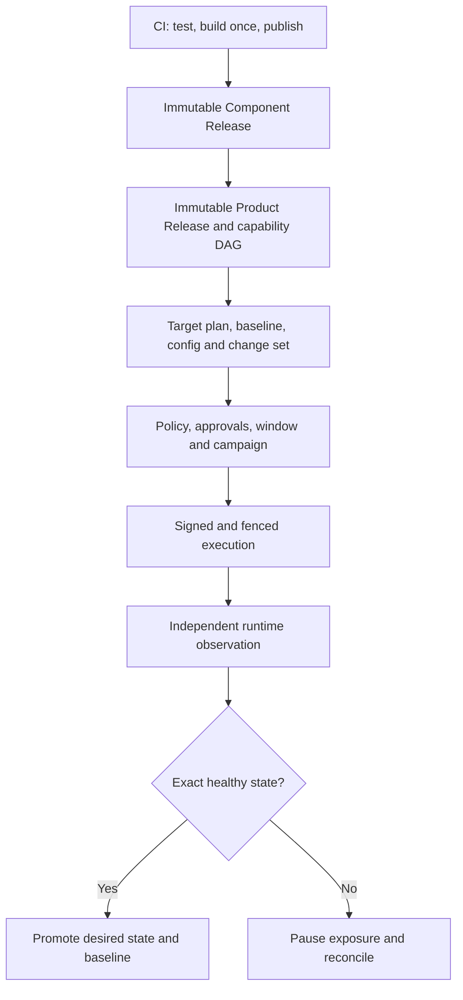

# Enterprise Client Deployment

This runbook describes the standard client workflow for the controlled
deployment path. It separates build and publication from target mutation,
freezes every execution input, and treats independent runtime observation as
the success gate.

The workflow is default-off. Complete the PR-083 release gate and the adopter's
read-only inventory and approval gates before enabling client execution. This
document does not claim that any client environment has completed these steps.

Related references:

- [Operator control-plane API](../api/operator-control-plane-api.md)
- [Backup and restore](control-plane-backup-restore.md)
- [v1/v2 rollback](control-plane-v1-v2-rollback.md)
- [Campaign incident response](control-plane-campaign-incident.md)

## Operating boundary

The responsibilities are deliberately separate:

| Owner                | Responsibility                                                                      |
| -------------------- | ----------------------------------------------------------------------------------- |
| Component CI         | Test source, build each platform once, publish immutable bytes and release evidence |
| Release manager      | Assemble a compatible target-neutral Product Release                                |
| Deployment planner   | Freeze one target's config, providers, baseline, change set, and execution DAG      |
| Approver             | Decide against exact immutable plan or campaign checksums                           |
| Scheduler            | Admit frozen campaign members under windows, freezes, thresholds, and locks         |
| Executor adapter     | Mutate only the signed, checksum-bound inputs                                       |
| Independent observer | Measure actual digest, config, schema, capabilities, topology, and health           |
| Fleet operator       | Resolve drift or uncertainty without rewriting history                              |

## 1. Onboard a placement once

1. Register the customer, delivery model, environment, timezone, target,
   deployment unit, and physical component placements.
2. Classify every discovered root and placement as managed, shared, external,
   observe-only, or intentionally ignored with an owner and reason.
3. Map physical runtime names to stable logical components. Do not infer
   identity from a container name at deployment time.
4. Register platform constraints, executor and observer adapters, database
   resource keys, opaque secret references, maintenance calendars, freezes,
   policies, and ownership.
5. Place component pipelines in publish-only mode. Record any remaining direct
   deployment path as an expiring governed exception.
6. Run observe-only discovery and reconcile the recorded inventory with the
   actual runtime before enabling mutation.

An unclassified placement, ambiguous environment assignment, missing owner, or
unverified runtime baseline blocks controlled deployment.

## 2. Build once and publish only

The component pipeline:

1. checks out one immutable source commit;
2. runs tests, policy, dependency, license, vulnerability, and secret checks;
3. builds each required platform once;
4. pushes immutable artifacts;
5. records the manifest-list and platform digests;
6. generates signature, provenance, SBOM, test, and change references required
   by policy; and
7. publishes Component Release Contract v2.

Publication does not select a client, open a deployment window, or mutate a
target. CI must not run target deployment commands after publication.

### Version and digest rules

| Identity                         | Rule                                                                    |
| -------------------------------- | ----------------------------------------------------------------------- |
| Component version                | Follows that component's declared version policy, normally SemVer       |
| `(component, version, platform)` | Resolves to one digest only                                             |
| Rebuild with changed inputs      | Creates a new release identity and version; never replaces a digest     |
| Multi-platform release           | Records one manifest-list digest plus exact platform digests            |
| Human-friendly tag               | Locator only; never execution or observation identity                   |
| Product version                  | Identifies a compatible target-neutral component set                    |
| Config snapshot                  | Uses an immutable ID and checksum, not a product version                |
| Plan/campaign revision           | Identifies a frozen operational decision; it does not rebuild artifacts |

Artifact promotion copies or references the same bytes. It does not rebuild
them for another client or environment.

## 3. Assemble the Product Release

Select exact Component Release IDs and publish a target-neutral Product Release
Manifest. It freezes:

- component releases and platform coverage;
- supplied and required capability versions;
- migration compatibility and ordering;
- target-stage requirements and their allowed resolution modes;
- release notes and canonical checksum; and
- no client variables, wave membership, secret references, or target config.

Publication fails on cycles, conflicting capability ranges, missing
product-stage providers, inconsistent migration constraints, or target-stage
requirements without explicit resolution modes.

### Resolve service dependencies through capabilities

A consumer does not trigger an ad hoc deployment of a named companion service.
It declares a versioned capability requirement. Planning must select exactly one
resolution:

| Resolution          | Required evidence                                                                               |
| ------------------- | ----------------------------------------------------------------------------------------------- |
| `included`          | Compatible provider release is in the Product Release and provider steps precede consumer steps |
| `pinned-existing`   | Exact compatible provider digest/config/capability has a fresh healthy observation              |
| `shared-provider`   | Registered shared unit, subscriber blast radius, exact provider state, and policy               |
| `approved-external` | Registered external binding, contract probe, health evidence, and approval                      |
| `feature-disabled`  | Frozen config flag and policy explicitly remove the requirement                                 |
| `unresolved`        | Plan publication is blocked                                                                     |

For a consumer requiring a transaction capability, the plan deploys only the
consumer when a compatible observed provider is already pinned. An `included`
provider must already be one of the exact Component Releases in the immutable
Product Release. Planning then places that provider's migration, deployment,
and health nodes before the consumer.

If the required provider is absent, do not let planning add it implicitly and
do not edit the published Product Release. Publish a new Product Release that
includes an exact compatible provider release, then create a new target plan
and obtain approvals for its new checksum and expanded runtime scope. If
neither that path nor an approved external/disabled mode is valid, publication
or planning blocks. The system never silently deploys two services together.

## 4. Freeze target configuration

Create one Target Config Snapshot from an immutable source commit. It records:

- deployment and service object references with checksums;
- physical-to-logical placement mappings;
- target platform and runtime constraints;
- provider versions and feature flags used for resolution;
- adapter input references and checksums;
- opaque secret references and non-reversible fingerprints, never values; and
- the canonical snapshot checksum.

A source repository moving later does not alter the snapshot. Any material
config change requires a new snapshot and plan.

## 5. Select the exact baseline and changelog

For every Component Instance:

1. Find the newest completed execution for the same placement whose required
   independent observations are healthy.
2. Verify the observation's exact artifact digest and config checksum.
   Executor completion alone is not a baseline.
3. Freeze the baseline execution and observation IDs in the new plan.
4. If no verified healthy state exists, classify the component as an initial
   deployment and apply the environment's bootstrap policy.
5. Compare desired and baseline artifact, config, provider, schema, capability,
   topology, and feature-flag facts.
6. Accumulate source release notes across every skipped release.
7. Verify that the baseline source revision is an ancestor of the candidate.
   When it is not, stop automatic comparison and attach a reviewed divergence
   report covering both histories; a simple `baseline..candidate` log is not a
   complete change record.
8. Canonicalize and checksum the resulting change set and any divergence
   evidence.

This means “since last deployment” always means “since this placement's last
verified healthy observed deployment,” not the preceding semantic version.
Skipped releases, hotfixes, and client-specific config revisions are included.
For bootstrap, the report explicitly says there is no prior healthy baseline;
it does not manufacture an empty or version-zero deployment.

The operator reviews three separate views:

| View                    | Baseline                              | Contents                                                              |
| ----------------------- | ------------------------------------- | --------------------------------------------------------------------- |
| Component release notes | Prior source/release                  | Commits, work items, build identity, digest, capabilities, operations |
| Target change set       | Last healthy observed placement state | Accumulated code/config/provider/schema/topology changes and risk     |
| Campaign summary        | Frozen member plans                   | Targets, waves, blast radius, windows, thresholds, exclusions         |

## 6. Publish the target plan

The planner freezes:

- exact Product Release and Target Config Snapshot checksums;
- customer, environment, target, deployment unit, and component identities;
- baseline execution and observation IDs;
- provider resolution and capability graph;
- migrations, backups, validations, recovery actions, and health gates;
- stable step keys, prerequisites, locks, timeouts, retry class, cancellation
  behavior, and expected input checksums;
- lifecycle, policy, window, and freeze versions; and
- canonical target plan checksum.

Preflight refuses identity substitution, platform or digest mismatch, stale
provider health, unresolved dependency, incompatible schema, missing backup,
invalid secret reference, stale baseline, lock conflict, closed eligibility, or
material input drift.

A correction creates a superseding plan. It never edits a published plan.

## 7. Approve and schedule

1. Evaluate each member plan's policy and approval requirements.
2. Review the exact change set, dependency DAG, migrations, backup evidence,
   blast radius, risk, window, freeze, and exception use.
3. Record decisions against the immutable plan checksum.
4. Publish an immutable campaign revision with exact member plan IDs/checksums,
   waves, order, concurrency, bake periods, thresholds, prerequisites, and
   policy versions.
5. Record any additional campaign-level blast-radius approval.
6. Re-evaluate start-time gates before each admission.

A controlled client deployment uses four-eyes separation: the actor requesting
execution cannot approve that same immutable plan or campaign. The decision
must come from a distinct authorized organization actor, and the retained
evidence identifies both actors and the policy version.

A temporarily closed window or unavailable concurrency slot waits without
changing the checksum. A changed artifact, config, provider, baseline, policy
version, campaign membership/order, threshold, or override requires a new
revision and approval.

Planning, read-only discovery, and immutable metadata preparation do not
authorize external mutation. Before execution, obtain explicit approval naming
every client runtime, client workload database, and companion-service runtime
that the frozen DAG may change. Missing approval blocks only those mutations;
it does not authorize the executor to narrow or rewrite the approved DAG.

## 8. Execute and observe

The scheduler acquires target, component, deployment-unit, adapter, and database
locks as required. The signed execution intent contains only the frozen plan,
step, digest, config, adapter, fence, timeout, callback, and idempotency facts.

The adapter verifies the intent and executes the supplied DAG without resolving
new releases or config. It reports ordered idempotent events. The independent
observer separately measures the actual digest, config checksum, schema,
capabilities, platform, topology, and health.

Success requires the policy-defined observation gate:

- admission creates pending desired state;
- a matching trusted observation promotes verified components to active desired
  state;
- failed, cancelled, or unknown components retain their prior active state;
- partial success advances only independently verified components; and
- locks are released or transferred only under terminal/fencing rules.

## 9. Reconcile and operate

Artifact, config, schema, capability, provider, health, platform, topology,
staleness, missing evidence, or executor/observer mismatch opens a drift case.
The operator may create a corrective plan, restore desired state, approve a
time-bounded exception, or close with matching trusted evidence. The system
never rewrites desired state merely to match drift.

Later plans always use the latest healthy independently observed placement
state. Audit evidence correlates release, config, plan, approval, campaign,
execution, adapter, observation, reconciliation, actor, outcome, and checksums.

## 10. Deploy a previous state

Previous-state deployment creates a new immutable plan targeting exact retained
artifact, config, provider, and baseline facts. It preserves both the current
and earlier execution history.

Before approval, verify current schema and provider contracts remain compatible
with the older application state. If compatibility is not proven, block the
previous-state plan and use a forward-fix or separately approved recovery plan.
Database restore is never an automatic side effect of previous-state
deployment.

## Evidence and proof boundary

Retain source/built commits, versions, artifact digests, provenance/SBOM
references, config checksums, baseline observations, accumulated changelog,
plans, approvals, campaign revisions, execution attempts, independent
observations, reconciliation, audit bundle, and backup/recovery evidence.

Neutral fixtures and repository tests prove contracts only. Record a live,
staging, production, or adopter result only after running this complete
procedure against that environment and retaining independently reviewed
evidence.
