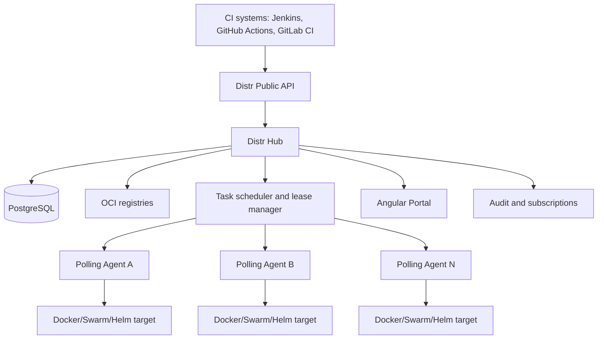

# Distr Community Fork — Master Product and Implementation Plan

## One-file roadmap for reusable Octopus-like deployment features

**Document status:** Codex-ready product and implementation plan  
**Prepared for:** Emlo Technologies and future open-source contributors  
**Date:** 2026-06-20  
**Base project:** `distr-sh/distr` Community Edition  
**License:** Apache License 2.0  
**Primary objective:** Extend Distr with broadly reusable release-management features; use Emlo as the first real adopter, not as the product model.

---

## Single-file operating contract

This document is the sole product, architecture, implementation, and Codex-execution source of truth for this fork.

Use it as follows:

1. Commit this file to `docs/roadmaps/DISTR_COMMUNITY_FORK_MASTER_PLAN.md` in the Distr fork.
2. Create or update the repository `AGENTS.md` so Codex is required to read this file before making roadmap changes.
3. Implement exactly one pull request from Section 40 at a time, beginning with PR-000.
4. Do not ask Codex to implement the complete roadmap in one task.
5. Review, test, and merge each prerequisite pull request before starting its dependent pull request.
6. Keep all core names, APIs, database structures, UI labels, and documentation community-neutral.
7. Put adopter-specific integrations in adapters, Step Templates, examples, or separate repositories.
8. Treat Sections 0–47 as binding unless an accepted ADR intentionally supersedes part of the plan.

The desired outcome is an upstream-friendly deployment platform, not a private Emlo-only application and not a literal copy of Octopus Deploy.

---

## 0. Final direction

Fork Distr Community Edition and add a focused set of mature deployment-management capabilities inspired by Octopus Deploy.

The fork must remain useful to any software vendor that deploys Docker Compose, Docker Swarm, Helm, or other packaged applications into customer-managed or BYOC environments.

The core must **not** contain hard-coded concepts such as:

```text
Emlo
remittance
EF Core
Kafka
Envoy
Jenkins
Amazon ECR
Angular
appsettings.Production.json
```

Those technologies are supported through generic APIs, scoped variables, OCI artifacts, reusable step templates, and provider adapters.

The product direction is:

```text
Distr today
  customer organizations
  applications and versions
  deployment targets
  agents
  Docker/Helm deployment
  registry and visibility

Distr fork after this roadmap
  immutable release bundles
  environments and promotion lifecycles
  channels and version rules
  reusable deployment processes
  scoped and snapshotted variables
  deployment planning and change preview
  approvals and manual interventions
  rollout groups and progressive deployment
  rolling / blue-green strategies
  runbooks
  guided failure, retry, resume, and exclusion
  deployment timeline and rollback selection
  task locks and concurrency policy
  maintenance windows and deployment freezes
  reusable step templates
  stronger audit, RBAC, notifications, and retention
```

This is not an attempt to reproduce every Octopus feature. It is a coherent open-source release platform that closes the most important gaps in Distr while preserving its customer-deployment strengths.

---

## 1. How to use this plan with Codex

Place this file in the fork at:

```text
docs/roadmaps/DISTR_COMMUNITY_FORK_MASTER_PLAN.md
```

Codex must implement one pull request from **Section 40** at a time.

Before the first code change, Codex must:

1. Read the current repository's `CLAUDE.md`, `CONTRIBUTING.md`, `SECURITY.md`, `mise.toml`, existing migrations, handlers, database functions, Angular conventions, and agent code.
2. Record the exact upstream commit in `docs/fork/UPSTREAM_BASE.md`.
3. Run the existing Community build and tests.
4. Confirm actual package and file paths because upstream can change.
5. Write an architecture decision record before changing an existing public API or agent protocol.
6. Keep new capabilities behind experimental feature flags until their milestone is complete.
7. Add tests with each behavior change.
8. Avoid unrelated refactoring.
9. Never copy proprietary Octopus code, assets, text, or UI. Implement common deployment concepts independently.
10. Preserve the Apache-2.0 license and upstream notices.

Every Codex pull request must report:

```text
Purpose
Generic user story
Data model changes
API changes
UI changes
Agent changes
Compatibility impact
Security impact
Tests executed
Manual verification
Known limitations
```

---

## 2. Community-first design rules

### 2.1 Generic names only

Use names such as:

```text
Release Bundle
Environment
Lifecycle
Channel
Deployment Process
Step Template
Variable Set
Tenant Tag
Rollout Group
Runbook
Manual Intervention
Deployment Freeze
```

Do not use organization-specific names in database tables, APIs, or UI labels.

### 2.2 Integrations, not hard-coding

A database migration is a generic one-shot OCI job or community step template. It is not an `EFMigration` core entity.

A Kafka change is a generic OCI job or plugin. It is not a `KafkaTopicOperation` core entity.

A load-balancer switch is a traffic-provider adapter or webhook step. It is not an `EnvoySwitch` core entity.

A Jenkins pipeline calls the release API. Jenkins is not embedded in the core.

### 2.3 Backward compatibility

Existing Distr application-version deployments must continue to work. Advanced release features are additive.

### 2.4 API-first

Every UI capability must have a documented API. CI systems and external portals must not depend on private browser endpoints.

### 2.5 Declarative desired state

The Hub stores desired releases, processes, variables, and deployment state. Agents report observed state and step evidence.

### 2.6 Immutable execution snapshots

A deployment runs against immutable snapshots of:

```text
release contents
process revision
resolved non-secret variables
secret references
step-template versions
channel and lifecycle selection
```

Later edits must not silently change an already-created release or deployment.

### 2.7 Safe extensibility

Prefer typed step actions and JSON schemas. Avoid arbitrary host shell execution in the first implementation.

### 2.8 Upstreamability

Every major feature must have:

- generic documentation;
- a neutral example application;
- migration and rollback notes;
- a stable API contract;
- tests independent of Emlo infrastructure;
- no dependency on a single cloud, registry, database, or CI platform.

---

## 3. Existing Distr foundation

Distr already provides a strong foundation for this roadmap:

- Open-source self-hosted control plane.
- Apache-2.0 licensing.
- Go backend.
- Angular frontend.
- PostgreSQL storage.
- REST API and JavaScript/TypeScript SDK.
- Customer organizations and portals.
- Applications and application versions.
- Deployment targets and polling agents.
- Docker Compose, Docker Swarm, and Helm-oriented distribution.
- Environment-variable templates.
- Secret-management integration.
- Agent status, application health, logs, and metrics.
- Registry and OCI artifact support.
- Pre-flight checks.

The fork should reuse these capabilities rather than replacing them.

Known gaps relevant to this roadmap include:

- no first-class immutable multi-component release bundle;
- no generic environment promotion lifecycle;
- limited release-channel behavior;
- no general process snapshot and reusable step library comparable to mature release tools;
- no complete deployment-plan preview;
- limited approval and manual-intervention model in Community;
- no generic runbook model equivalent to deployment-independent operational workflows;
- no rich guided-failure workflow;
- insufficient scoped-variable reconciliation for existing deployments;
- no complete release timeline and promotion dashboard;
- no general maintenance-window/deployment-freeze model.

---

## 4. Octopus feature review and selection

The roadmap adopts deployment concepts that are broadly useful and fit Distr's architecture.

| Octopus-like concept                | Value to Distr users | Decision                                             |                             Priority |
| ----------------------------------- | -------------------: | ---------------------------------------------------- | -----------------------------------: |
| Releases as immutable snapshots     |            Very high | Implement as Release Bundles                         |                                   P0 |
| Environments                        |            Very high | Implement                                            |                                   P0 |
| Lifecycles and promotion rules      |            Very high | Implement                                            |                                   P0 |
| Channels and version rules          |                 High | Implement                                            |                                   P0 |
| Scoped variables and variable sets  |            Very high | Implement                                            |                                   P0 |
| Deployment process snapshots        |            Very high | Implement                                            |                                   P0 |
| Deployment plan/change preview      |            Very high | Implement                                            |                                   P0 |
| Manual intervention/approval        |            Very high | Implement                                            |                                   P0 |
| Tenant tags/release rings           |                 High | Implement as tag sets and rollout groups             |                                   P0 |
| Task locks and concurrency          |            Very high | Implement                                            |                                   P0 |
| Deployment timeline                 |                 High | Implement                                            |                                   P1 |
| Rolling deployments                 |                 High | Implement                                            |                                   P1 |
| Blue-green strategy                 |                 High | Implement through generic traffic adapters           |                                   P1 |
| Guided failure                      |                 High | Implement retry, skip, exclude, abort                |                                   P1 |
| Runbooks                            |                 High | Implement                                            |                                   P1 |
| Reusable step templates             |            Very high | Implement                                            |                                   P1 |
| Run conditions/output variables     |                 High | Implement                                            |                                   P1 |
| Maintenance windows/freezes         |                 High | Implement                                            |                                   P1 |
| Notifications/subscriptions         |               Medium | Implement webhooks first                             |                                   P1 |
| Retention policies                  |               Medium | Implement                                            |                                   P2 |
| Fine-grained RBAC                   |                 High | Extend existing authorization                        | P2, earlier if needed for Production |
| Config as Code                      |     High but complex | Implement after data model stabilizes                |                                   P2 |
| Worker pools                        |               Medium | Defer; use target agents initially                   |                                Later |
| Spaces/full isolation domains       |               Medium | Defer; organizations already cover primary isolation |                                Later |
| Ephemeral environments              |               Medium | Defer until lifecycle model is stable                |                                Later |
| Generic script console              |                Risky | Do not implement initially                           |                             Excluded |
| Full package repository replacement |                  Low | Distr already has registry capabilities              |                             Excluded |
| Full Octopus UI reproduction        |                 None | Do not copy                                          |                             Excluded |

### 4.1 Minimum useful community release

The first major release of the fork should include:

```text
Release Bundles
Environments
Lifecycles
Channels
Process snapshots
Scoped variables and snapshots
Deployment plan preview
Approvals
Tag sets and rollout groups
Locks and task queue
Generic OCI-job step
Compose/Helm deployment step
HTTP health step
Webhook step
Deployment timeline
```

### 4.2 Production-grade follow-up

The next release should add:

```text
Step Templates
Runbooks
Rolling and blue-green strategies
Guided failure
Maintenance windows and freezes
Notifications
Output variables and conditions
Retention
Expanded RBAC
```

---

## 5. Product information architecture

Recommended navigation:

```text
Dashboard
Applications
  Applications
  Release Bundles
  Channels
  Deployment Processes
  Runbooks
Infrastructure
  Environments
  Deployment Targets
  Tag Sets
  Rollout Groups
Library
  Step Templates
  Variable Sets
  Accounts / Secret References
Tasks
  Deployments
  Approvals
  Runbook Runs
  Timeline
Configuration
  Lifecycles
  Deployment Freezes
  Subscriptions
  Teams and Roles
  Retention
```

Existing Distr application and customer screens remain available.

---

## 6. Core conceptual model

### 6.1 Application

An existing Distr application remains the primary deployable product definition.

### 6.2 Application Version

An existing application version remains a versioned Docker Compose, Swarm, Helm, or OCI-based deployable definition.

### 6.3 Release Bundle

A Release Bundle is a new immutable snapshot that can coordinate one or more application versions and artifacts.

Examples:

```text
Single application release
Multiple microservice applications released together
Frontend + API + migration utility
Parent release coordinating child releases
```

### 6.4 Environment

An Environment groups targets by promotion stage or operational purpose:

```text
Development
Test
Staging
Production
Customer Production
Edge Ring A
```

An environment is generic and not tied to one customer model.

### 6.5 Lifecycle

A Lifecycle defines ordered phases, promotion requirements, automatic deployment rules, and retention behavior.

### 6.6 Channel

A Channel selects a lifecycle, version rules, allowed source branches/tags, optional process conditions, and eligible tenant tags.

Examples:

```text
Preview
Stable
Hotfix
Long-Term Support
Early Access
```

### 6.7 Deployment Process

A Deployment Process is a reusable ordered or grouped set of typed steps.

### 6.8 Process Snapshot

A Process Snapshot is the immutable revision used by a release.

### 6.9 Step Template

A Step Template is a reusable versioned action definition with a JSON-schema input contract.

### 6.10 Variable Set

A Variable Set is a reusable collection of scoped variables and secret references.

### 6.11 Runbook

A Runbook is a versioned operational process that is not tied to release promotion.

### 6.12 Deployment Plan

A Deployment Plan is a resolved, immutable preview of what a deployment will do.

### 6.13 Task

A Task is an executable deployment or runbook instance with step-level state and logs.

---

## 7. Target architecture



Execution locations:

```text
Hub-only steps
  manual intervention
  approval gate
  notification
  child-release coordination

Target-agent steps
  pre-flight checks
  OCI job
  file/template rendering
  Docker Compose deploy
  Helm deploy
  HTTP health check
  traffic adapter

Future worker steps
  cloud API or shared infrastructure actions not tied to a target
```

---

## 8. Feature specification: Release Bundles

### 8.1 User value

A Release Bundle creates one stable deployable snapshot even when a product contains multiple applications, images, charts, scripts, or configuration resources.

### 8.2 Requirements

A Release Bundle must contain:

```text
release number
application or product scope
channel
release notes
source revision metadata
one or more versioned components
process snapshot ID
variable snapshot ID
step-template version references
artifact digests
creation actor and time
publication actor and time
```

### 8.3 States

```text
DRAFT
VALIDATING
PUBLISHED
BLOCKED
ARCHIVED
```

Rules:

- Drafts are editable.
- Published releases are immutable.
- Blocking prevents new deployments but preserves history.
- Archiving removes the release from normal selection without deleting audit history.
- Replacing a published release requires a new release number.

### 8.4 Components

A release component may reference:

```text
Distr application version
OCI image by digest
OCI artifact
Helm chart version
child release bundle
external artifact URL with checksum
```

### 8.5 Compatibility

Existing direct application-version deployments remain valid. A compatibility adapter may create an implicit single-component release for the new planner and timeline.

### 8.6 API outline

```http
POST   /api/v1/release-bundles
GET    /api/v1/release-bundles
GET    /api/v1/release-bundles/{id}
PATCH  /api/v1/release-bundles/{id}        # draft only
POST   /api/v1/release-bundles/{id}/validate
POST   /api/v1/release-bundles/{id}/publish
POST   /api/v1/release-bundles/{id}/block
POST   /api/v1/release-bundles/{id}/archive
```

### 8.7 Acceptance criteria

- A release can coordinate at least 50 components.
- A published release produces the same canonical checksum on repeated reads.
- The UI clearly shows all component versions and digests.
- A component cannot be silently changed after publication.
- Existing simple deployments are not broken.

---

## 9. Feature specification: Environments and Lifecycles

### 9.1 Environment model

An environment has:

```text
id
name
description
sort_order
is_production
allow_dynamic_targets
retention_policy_id
created_at
updated_at
```

Deployment targets may be assigned to one or more environments according to existing Distr constraints.

### 9.2 Lifecycle model

A lifecycle has ordered phases. Each phase contains:

```text
name
order
one or more environments
optional or required
manual or automatic promotion
minimum successful deployments
approval policy
retention policy
```

### 9.3 Promotion rules

The lifecycle engine must answer:

```text
Is this release eligible for this environment?
Which earlier phase is missing?
Is the phase optional?
Does the selected channel use a different lifecycle?
Is approval required?
Is a freeze active?
```

### 9.4 Generic examples

```text
Standard:
  Development -> Staging -> Production

Customer rings:
  Internal -> Early Adopters -> General Availability

Hotfix:
  Test -> Production
```

### 9.5 Acceptance criteria

- A release cannot bypass a required prior phase unless an authorized override is recorded.
- Optional phases may be skipped.
- Automatic phases enqueue only after prior requirements succeed.
- The eligibility API explains every blocking reason.

---

## 10. Feature specification: Channels and Version Rules

### 10.1 Purpose

Channels allow one application to support different release strategies without copying the application definition.

### 10.2 Channel properties

```text
name
description
is_default
lifecycle_id
release_number_pattern
allowed_version_ranges
allowed_prerelease_patterns
allowed_source_branches
allowed_source_tags
eligible_tenant_tags
eligible_target_tags
custom_release_fields_schema
```

### 10.3 Initial channels

The system should create a default channel automatically.

Generic examples:

```text
Stable
Preview
Hotfix
LTS
Early Access
```

### 10.4 Rule engine

Version rules must support SemVer 2.0 ranges and prerelease patterns. Source rules support glob patterns for branches and tags.

### 10.5 Acceptance criteria

- The release form filters component versions according to the channel.
- The API returns clear validation errors for disallowed versions or sources.
- A channel can select a different lifecycle.
- A deployment step may have a channel condition.

---

## 11. Feature specification: Deployment Processes and Snapshots

### 11.1 Process structure

A process contains ordered steps and optional parallel groups.

Each step includes:

```text
key
name
action_type
step_template_version_id nullable
execution_location
input_bindings
condition
channels
environments
target_tags
failure_mode
timeout
retry_policy
required_permissions
```

### 11.2 Process revision

Editing a process creates a new revision. Publishing a release snapshots the exact revision.

### 11.3 Step groups

Support:

```text
sequential group
parallel group
rolling group
manual intervention
child release group
```

### 11.4 Conditions

Initial condition language should be deliberately small:

```text
success()
failure()
always()
channel == "Stable"
environment.isProduction
variable("Feature.Enabled") == "true"
output("step-key", "name") == "value"
```

Do not embed a general-purpose programming language in phase one.

### 11.5 Output variables

A step may return typed output values. Sensitive outputs must be explicitly marked and encrypted.

### 11.6 Acceptance criteria

- A release always references an immutable process revision.
- Process edits do not alter existing release execution.
- Step conditions are validated before publication.
- Cyclic step dependencies are rejected.
- Parallel groups preserve deterministic dependency ordering.

---

## 12. Feature specification: Step Templates

### 12.1 Purpose

Step Templates allow the community to build reusable deployment actions without putting every technology into Distr core.

### 12.2 Template contract

A template contains:

```text
id
key
name
description
version
action_type
input_json_schema
output_json_schema
default_inputs
execution_location
implementation_reference
publisher
license
signature/checksum
deprecated
```

### 12.3 Versioning

- Templates use immutable semantic versions.
- Processes reference an exact template version.
- A UI action can offer to upgrade references and show an input diff.
- Automatic upgrades are never enabled by default.

### 12.4 Template sources

Initial sources:

```text
built into Distr
installed from a signed OCI artifact
imported from a JSON/YAML definition
```

### 12.5 Community repository

Create a separate repository:

```text
distr-sh/community-step-templates
```

Suggested generic templates:

```text
OCI one-shot job
HTTP health check
Webhook
Render file from template
Database migration container
Notification webhook
Traffic switch webhook
Wait/delay
Compose command
Helm test
```

Emlo-specific templates may live in a separate repository and can be generalized before community contribution.

### 12.6 Acceptance criteria

- A user can install, version, use, and deprecate a template.
- Invalid inputs are blocked at process-edit and plan time.
- Template code cannot gain more permissions than its declared action type.
- A process remains executable when a newer template version is published.

---

## 13. Feature specification: Variables and Variable Sets

### 13.1 Variable types

```text
string
number
boolean
JSON
secret reference
account reference
certificate reference
```

### 13.2 Scope dimensions

Support scoped values by:

```text
organization/tenant
environment
channel
deployment target
target tag
application
process step
runbook
```

### 13.3 Resolution precedence

Use deterministic most-specific resolution. A recommended precedence is:

```text
prompted deployment value
exact tenant + environment + target + channel + step
exact tenant + environment + target
exact tenant + environment + channel
exact tenant + environment
exact environment + target tag
exact environment
channel
application
unscoped default
```

The resolver must expose an explanation trace showing which candidate won without revealing secret values.

### 13.4 Variable sets

Reusable variable sets may be linked to multiple applications or runbooks.

### 13.5 Snapshots

At release publication:

- snapshot non-secret values used by the release;
- snapshot references and metadata for secrets, not plaintext secret values;
- resolve the actual secret at execution time according to policy;
- record the secret version/reference identifier when the provider supports it.

### 13.6 Existing deployment reconciliation

Add a schema-aware configuration reconciliation view:

```text
new required variables
missing variables
removed variables
type changes
default changes
secret-reference changes
```

This directly improves on the current environment-template limitation where existing deployments do not receive newly added variables automatically.

### 13.7 Acceptance criteria

- Resolution is deterministic and unit-tested for all scope combinations.
- The UI explains source and scope for every non-secret resolved value.
- Secret values never appear in logs or API JSON.
- A deployment plan fails when a required variable is unresolved.
- Existing deployments show configuration drift after schema changes.

---

## 14. Feature specification: Deployment Plan and Change Preview

### 14.1 Purpose

Before execution, users must see exactly what will happen.

### 14.2 Plan contents

```text
release and process snapshots
targets selected
resolved steps in execution order
components changing
components unchanged
variable/config changes with secret values redacted
artifacts and digests
pre-flight checks
approvals required
maintenance/freeze constraints
estimated concurrency strategy
rollback availability
warnings and blockers
```

### 14.3 Plan states

```text
DRAFT
VALIDATING
BLOCKED
AWAITING_APPROVAL
READY
EXPIRED
EXECUTED
```

### 14.4 Canonical checksum

A ready plan receives a canonical checksum. Approval applies to that checksum. Any material change creates a new plan and invalidates old approvals.

### 14.5 Dry run

The agent may perform read-only remote checks during planning:

```text
agent online
runtime version
disk capacity
registry access
current deployment state
required tool availability
health endpoint accessibility
```

No mutating step runs during dry-run planning.

### 14.6 Acceptance criteria

- The UI separates blockers, warnings, and informational changes.
- Users can export the plan as JSON and Markdown.
- Approval is tied to the exact plan checksum.
- Plan regeneration clearly displays the delta from the prior plan.

---

## 15. Feature specification: Approvals and Manual Interventions

### 15.1 Approval policy

A policy may be attached to:

```text
lifecycle phase
environment
channel
step template
individual process step
risk classification
deployment freeze override
```

### 15.2 Approval requirements

Support:

```text
one approver from a team
N approvers from a team
one approver from each of several teams
requester cannot approve own deployment
approval expiration
approval comments required
```

### 15.3 Manual intervention step

A running task can pause and present:

```text
instructions
resolved context with secrets redacted
artifacts for review
allowed responses
responsible teams
deadline
```

Responses:

```text
Proceed
Abort
Retry previous step
Mark failed
```

### 15.4 Audit

Record requester, approvers, comments, timestamps, plan checksum, and IP/session metadata according to existing privacy policy.

### 15.5 Acceptance criteria

- A user cannot approve without the required scoped permission.
- A changed plan invalidates approval.
- Expired approvals cannot start deployment.
- Separation-of-duties policy is enforced server-side.

---

## 16. Feature specification: Tag Sets and Rollout Groups

### 16.1 Tag sets

Provide reusable categorized tags for:

```text
tenants/customers
deployment targets
environments
applications
```

Examples:

```text
Release Ring / Internal
Release Ring / Early Adopter
Region / Europe
Tier / Enterprise
Runtime / Docker
```

### 16.2 Rollout groups

A rollout group selects targets or tenants by explicit membership or tag expression.

### 16.3 Wave execution

A release can deploy through ordered rollout groups:

```text
Internal
Pilot
Wave 1
Wave 2
General Availability
```

Each wave may define:

```text
maximum parallel tasks
pause after wave
required health observation interval
approval before next wave
failure threshold
```

### 16.4 Generic failure policy

```text
pause wave after first failure
pause when failure percentage exceeds threshold
continue healthy members
abort remaining members
```

### 16.5 Acceptance criteria

- The preview lists exact resolved members before execution.
- Membership changes after plan approval do not silently alter the approved plan.
- Each target receives an independent task record.
- A wave can be resumed without redeploying already-successful members.

---

## 17. Feature specification: Task Queue, Locks, and Concurrency

### 17.1 Task queue

The Hub owns durable tasks. Agents lease executable work.

### 17.2 Lease model

A lease contains:

```text
task_id
agent_id
lease_token
leased_at
expires_at
heartbeat_at
attempt
```

An expired lease may be reclaimed only after idempotency checks.

### 17.3 Lock resources

Locks can protect:

```text
deployment target
tenant + environment
application + environment
custom named resource
```

### 17.4 Concurrency policies

```text
QUEUE
CANCEL_OLDER
REJECT_NEW
ALLOW_PARALLEL
```

Default for the same target is `QUEUE`.

### 17.5 Acceptance criteria

- Two tasks cannot mutate the same exclusive target concurrently.
- Agent restart does not lose task state.
- Heartbeat loss is visible and recoverable.
- Retried tasks reuse operation idempotency keys.

---

## 18. Feature specification: Guided Failure

### 18.1 Failure states

When a step fails, policy determines whether the task immediately fails or pauses for guidance.

### 18.2 Allowed decisions

```text
Retry step
Retry from checkpoint
Ignore and continue
Exclude target and continue
Abort task
Rollback application traffic where supported
```

### 18.3 Guardrails

- Ignore is disabled for steps marked mandatory.
- Database or irreversible steps cannot be retried unless declared idempotent.
- Exclusion is available only for multi-target/rolling execution.
- Every decision requires a reason and is audited.

### 18.4 Acceptance criteria

- A paused task survives Hub restart.
- The UI displays the failed step, logs, attempt history, and safe actions.
- Unauthorized users cannot guide failures.
- Retry does not duplicate successful idempotent operations.

---

## 19. Feature specification: Deployment Strategies

### 19.1 Strategy abstraction

A deployment step may select a strategy:

```text
RECREATE
ROLLING
BLUE_GREEN
CANARY
CUSTOM_ADAPTER
```

Not every agent/runtime must support every strategy. Capabilities are advertised by the agent and validated during planning.

### 19.2 Recreate

Current behavior: update the application directly through Compose, Swarm, or Helm.

### 19.3 Rolling

Parameters:

```text
window_size
maximum_unavailable
pause_between_windows
health_check_step
failure_threshold
```

The scheduler processes target subsets and retains per-target state.

### 19.4 Blue-green

Generic phases:

```text
create inactive slot
apply release to inactive slot
run readiness and smoke checks
invoke traffic provider to move traffic
observe health
mark new slot active
retain or remove prior slot according to policy
```

A traffic provider interface must be generic:

```go
type TrafficProvider interface {
    Prepare(ctx context.Context, request PrepareRequest) (PreparedTarget, error)
    Shift(ctx context.Context, request ShiftRequest) error
    Verify(ctx context.Context, request VerifyRequest) error
    Rollback(ctx context.Context, request RollbackRequest) error
    Cleanup(ctx context.Context, request CleanupRequest) error
}
```

Initial provider implementations:

```text
Webhook provider
File-render provider
Docker label/provider adapter
```

Envoy, Nginx, cloud load balancers, and other proxies are community adapters, not core assumptions.

### 19.5 Canary

Canary is P2 unless the traffic adapter can express weighted traffic safely.

Parameters:

```text
stages: 5%, 25%, 50%, 100%
observation_duration
health query adapter
manual or automatic promotion
rollback threshold
```

### 19.6 Acceptance criteria

- Unsupported strategies are blocked at plan time.
- Strategy phases appear as separate task steps.
- Traffic rollback is available without pretending to reverse a database change.
- Prior slot retention is configurable.

---

## 20. Feature specification: Runbooks

### 20.1 Purpose

Runbooks execute repeatable operational processes independently from application release promotion.

Generic examples:

```text
Backup database
Rotate certificate
Restart target
Collect diagnostics
Scale service
Validate connectivity
Restore from snapshot
```

### 20.2 Runbook structure

A runbook has:

```text
name
description
process revisions
published snapshot
allowed environments
allowed tenant/target tags
prompted variables
approval policy
schedule policy
```

### 20.3 Publishing

Draft runbook edits create new revisions. Operators execute a published snapshot unless explicitly authorized to run a draft in non-production environments.

### 20.4 Scheduling

Support one-time and cron-like schedules after the task engine is stable.

### 20.5 Acceptance criteria

- Runbook history is separate from deployment history.
- A published runbook snapshot remains immutable.
- Prompted variables are validated and audited.
- Production runbooks support approval and maintenance-window checks.

---

## 21. Feature specification: Maintenance Windows and Deployment Freezes

### 21.1 Maintenance windows

A recurring window defines when tasks may start or continue for selected environments, targets, tenants, tags, channels, or applications.

### 21.2 Deployment freezes

A freeze blocks new deployments during a specific period.

Fields:

```text
name
start_at
end_at
time_zone
scope
reason
override_policy
created_by
```

### 21.3 Override

An override requires:

```text
explicit permission
recorded reason
optional additional approval
exact deployment plan
```

### 21.4 Acceptance criteria

- Time-zone calculations are tested across daylight-saving changes.
- Active freezes are visible in the deployment planner.
- A queued task does not start outside its allowed window unless policy permits continuation.
- Override events appear in audit history.

---

## 22. Feature specification: Deployment Timeline and Rollback Selection

### 22.1 Timeline

Display deployments for an application/release, environment, tenant, and target in time order.

Each item shows:

```text
release number
channel
process revision
started and completed time
actor
result
component versions
targets
approvals
links to logs
```

### 22.2 Redeploy and promote

From the timeline, authorized users may:

```text
redeploy the same release
promote to an eligible environment
create a rollback deployment using a previous release
compare two deployments
```

### 22.3 Rollback language

The UI must say **deploy previous release**, not imply that all external state or databases are reversed.

### 22.4 Acceptance criteria

- The last successful release is clearly marked.
- Compare view shows components, variables, process, and template-version changes.
- Rollback preview warns about irreversible or forward-only steps.

---

## 23. Feature specification: Notifications and Subscriptions

### 23.1 Event model

Publish structured events for:

```text
release published
release blocked
deployment planned
approval requested
approval completed
deployment started
step failed
task paused
deployment succeeded
deployment failed
agent offline
configuration drift detected
freeze overridden
```

### 23.2 Subscription filters

Filter by:

```text
application
environment
channel
tenant tag
target tag
event severity
result
```

### 23.3 Delivery

Implement generic webhooks first. Email can follow using an SMTP adapter.

### 23.4 Reliability

Use an outbox table, retry policy, dead-letter state, request signature, and delivery log.

### 23.5 Acceptance criteria

- Deployment success is not blocked by a failed notification unless configured.
- Webhook retries are idempotent.
- Secret headers are encrypted and redacted.

---

## 24. Feature specification: RBAC and Audit

### 24.1 Permission families

Extend existing authorization with permissions such as:

```text
ReleaseView
ReleaseCreate
ReleasePublish
ReleaseBlock
ProcessView
ProcessEdit
VariableView
VariableEdit
SecretReferenceManage
DeploymentPlan
DeploymentExecute
DeploymentApprove
DeploymentGuideFailure
RunbookView
RunbookEdit
RunbookExecute
EnvironmentManage
TargetManage
FreezeManage
TemplateManage
AuditView
```

### 24.2 Scopes

Permissions may be scoped by:

```text
organization
application
environment
tenant/customer
tag set
```

Start with a manageable subset and avoid a policy language so complex that it cannot be audited.

### 24.3 Built-in roles

Suggested roles:

```text
Viewer
Developer
Release Manager
Deployment Operator
Approver
Runbook Operator
Environment Manager
Administrator
```

### 24.4 Audit events

Audit all changes to:

```text
releases
processes
variables and secret references
channels and lifecycles
approvals
manual interventions
failure guidance
runbooks
targets and tags
freezes
roles and teams
```

Audit records are append-only from the application perspective.

### 24.5 Acceptance criteria

- Server-side permission checks exist for every mutation endpoint.
- UI hiding is not treated as authorization.
- Audit events show before/after metadata with secret values removed.
- Individual user accounts are required for approval actions.

---

## 25. Feature specification: Retention Policies

### 25.1 Retained data categories

```text
release bundles
deployment tasks
step logs
agent logs
artifacts
runbook runs
audit records
```

### 25.2 Policy dimensions

```text
keep last N successful releases
keep failed tasks for N days
keep Production longer than Development
keep releases currently deployed anywhere
keep releases marked protected
```

### 25.3 Safety rules

- Never delete a release still deployed to a target.
- Never delete audit records before the configured compliance minimum.
- Preview cleanup before applying it.
- Keep component digest metadata even when large logs are removed.

---

## 26. Feature specification: Config as Code

Implement only after release, process, variable, channel, and lifecycle schemas stabilize.

### 26.1 Scope

Version-control:

```text
deployment processes
channels
lifecycles
non-secret variable definitions
step-template references
runbooks
```

Do not place plaintext secrets in Git.

### 26.2 Model

Use a declarative repository path with schema-versioned YAML/JSON and server-side validation.

### 26.3 Conflict handling

Choose one authority per resource:

```text
DATABASE_MANAGED
GIT_MANAGED
```

The UI must not silently overwrite Git-managed resources.

### 26.4 Later integration

Support branch protection rules and release snapshots referencing a Git commit.

---

## 27. Built-in generic step actions

The first stable action set should be small and broadly useful.

### 27.1 `distr.preflight`

Runs existing agent pre-flight checks and returns structured results.

### 27.2 `distr.compose.deploy`

Deploys or updates a Docker Compose application version.

Inputs:

```text
applicationVersion
projectName
environmentFile
pullPolicy
waitForHealthy
timeout
strategy
```

### 27.3 `distr.helm.deploy`

Uses existing Helm deployment behavior with immutable inputs.

### 27.4 `distr.oci.job`

Runs a one-shot OCI image with declared inputs.

Inputs:

```text
imageDigest
command
arguments
environment bindings
secret references
network selection
volume bindings from allowlisted paths
timeout
expectedExitCodes
idempotencyKey
```

This generic action can support migration tools, data importers, message-broker administration, validation utilities, and maintenance jobs without hard-coding them into core.

### 27.5 `distr.http.check`

Calls an HTTP endpoint and validates status, headers, body match, latency, and retry policy.

### 27.6 `distr.webhook`

Invokes an external API with signed/secret headers and captures declared outputs.

### 27.7 `distr.file.render`

Renders a text file from a restricted template engine and scoped variables.

Requirements:

```text
allowlisted destination roots
atomic write
mode/owner controls where supported
backup prior version
secret redaction
```

### 27.8 `distr.manual.intervention`

Pauses for authorized human input.

### 27.9 `distr.notification.webhook`

Sends a non-blocking or blocking notification according to policy.

### 27.10 `distr.child.release`

Coordinates another release bundle and waits for its result.

### 27.11 `distr.wait`

Waits for a duration or until a declared condition is met.

### 27.12 Actions intentionally excluded initially

```text
arbitrary host shell
unrestricted file access
interactive remote terminal
unreviewed plugin binary loaded into the Hub process
```

---

## 28. Execution engine and agent protocol

### 28.1 Hub scheduler

Add a durable scheduler responsible for:

```text
plan validation
task creation
approval state
lock acquisition
agent selection
lease assignment
heartbeat monitoring
retry scheduling
wave coordination
final status projection
```

Do not use in-memory state as the source of truth.

### 28.2 Agent capability advertisement

Agents report:

```text
agent version
supported runtimes
supported action types
supported action versions
operating system
architecture
available tooling
strategy capabilities
```

The planner blocks unsupported actions before execution.

### 28.3 Task lease response

A lease payload contains:

```json
{
  "taskId": "uuid",
  "planChecksum": "sha256:...",
  "leaseToken": "opaque-token",
  "expiresAt": "RFC3339",
  "steps": [
    {
      "stepRunId": "uuid",
      "key": "deploy-app",
      "actionType": "distr.compose.deploy",
      "actionVersion": "1",
      "inputs": {},
      "secretReferences": [],
      "idempotencyKey": "..."
    }
  ]
}
```

### 28.4 Progress reporting

The agent reports:

```text
step started
structured progress
redacted log chunks
step outputs
step succeeded
step failed
heartbeat
observed deployment state
```

### 28.5 Checkpoints

A checkpoint is created after a successful step marked `checkpoint=true`. Guided retry may resume from a safe checkpoint.

### 28.6 Idempotency

Each mutating step has an idempotency key derived from:

```text
release bundle
process snapshot
step key
target
attempt-independent operation identity
```

The agent keeps a small local operation journal, while the Hub keeps the authoritative task record.

### 28.7 Cancellation

Cancellation is cooperative:

- Hub marks cancellation requested.
- Agent stops before the next safe boundary.
- Long-running action implementations receive context cancellation.
- Non-interruptible actions report that cancellation is pending.

### 28.8 Agent upgrade compatibility

- Actions declare minimum agent versions.
- Hub and agent negotiate protocol version.
- At least one prior stable protocol version remains supported during an upgrade window.
- Database migration and API changes must not require all agents to update simultaneously.

---

## 29. Data model blueprint

Names must be adjusted to existing Distr conventions. The following model describes required relationships, not mandatory exact SQL.

### 29.1 Release tables

```text
release_bundles
  id
  application_id nullable
  release_number
  channel_id
  lifecycle_id
  process_snapshot_id
  variable_snapshot_id
  status
  release_notes
  source_metadata jsonb
  manifest_checksum
  created_by
  created_at
  published_by
  published_at

release_bundle_components
  id
  release_bundle_id
  component_key
  component_type
  application_version_id nullable
  child_release_bundle_id nullable
  artifact_reference
  artifact_digest
  version
  metadata jsonb
```

### 29.2 Environment and lifecycle tables

```text
environments
lifecycles
lifecycle_phases
lifecycle_phase_environments
channels
channel_version_rules
channel_source_rules
```

### 29.3 Process and template tables

```text
deployment_processes
process_revisions
process_steps
process_step_dependencies
step_templates
step_template_versions
```

Store process revision definitions in normalized rows or canonical JSON according to existing query patterns. Published snapshots must be immutable.

### 29.4 Variable tables

```text
variable_sets
variables
variable_values
variable_scopes
variable_set_links
variable_snapshots
variable_snapshot_values
```

Secret values must use existing encryption/secret-provider mechanisms and must not be duplicated into snapshots.

### 29.5 Planning and task tables

```text
deployment_plans
deployment_plan_targets
deployment_plan_steps
deployment_plan_warnings
approvals
approval_decisions
tasks
step_runs
task_leases
task_locks
task_checkpoints
step_outputs
```

### 29.6 Tags and waves

```text
tag_sets
tags
resource_tags
rollout_groups
rollout_group_rules
rollout_group_memberships
rollout_waves
wave_runs
```

### 29.7 Runbooks and operations

```text
runbooks
runbook_revisions
runbook_snapshots
runbook_schedules
runbook_runs
```

### 29.8 Governance

```text
deployment_freezes
maintenance_windows
subscriptions
webhook_deliveries
retention_policies
audit_events
```

### 29.9 Indexing requirements

Add indexes for:

```text
release number per application/channel
task status and queue order
agent lease expiration
target lock lookup
deployments by environment/tenant/application
step runs by task
resource tags
active freezes by time and scope
webhook delivery retry state
```

### 29.10 Migration policy

- Additive migrations first.
- New nullable columns before mandatory backfill.
- Backfill in a separate migration or application job.
- Add constraints after existing data is valid.
- Never remove old protocol fields in the same release that introduces replacements.
- Include downgrade notes even when SQL downgrade is not automated.

---

## 30. Public API design

### 30.1 API principles

- REST resources under `/api/v1` until a version bump is necessary.
- Cursor or page-based pagination consistent with upstream.
- Idempotency keys on create/deploy endpoints.
- ETags or revision numbers for concurrent edits.
- Structured validation errors.
- OpenAPI documentation and SDK generation.

### 30.2 Release endpoints

```http
GET    /api/v1/release-bundles
POST   /api/v1/release-bundles
GET    /api/v1/release-bundles/{id}
PATCH  /api/v1/release-bundles/{id}
POST   /api/v1/release-bundles/{id}/validate
POST   /api/v1/release-bundles/{id}/publish
POST   /api/v1/release-bundles/{id}/block
POST   /api/v1/release-bundles/{id}/archive
```

### 30.3 Environment and lifecycle endpoints

```http
/api/v1/environments
/api/v1/lifecycles
/api/v1/lifecycles/{id}/phases
/api/v1/channels
/api/v1/channels/{id}/validate-version
/api/v1/releases/{id}/eligibility
```

### 30.4 Process and template endpoints

```http
/api/v1/deployment-processes
/api/v1/deployment-processes/{id}/revisions
/api/v1/step-templates
/api/v1/step-templates/{id}/versions
/api/v1/step-templates/import
```

### 30.5 Variable endpoints

```http
/api/v1/variable-sets
/api/v1/variables/resolve-preview
/api/v1/variable-snapshots
/api/v1/deployments/{id}/configuration-drift
```

Secret resolution preview returns metadata and redacted placeholders only.

### 30.6 Planning and execution endpoints

```http
POST   /api/v1/deployment-plans
GET    /api/v1/deployment-plans/{id}
POST   /api/v1/deployment-plans/{id}/validate
POST   /api/v1/deployment-plans/{id}/request-approval
POST   /api/v1/deployment-plans/{id}/execute
POST   /api/v1/tasks/{id}/cancel
POST   /api/v1/tasks/{id}/guide
GET    /api/v1/tasks/{id}/timeline
GET    /api/v1/tasks/{id}/logs
```

### 30.7 Runbook endpoints

```http
/api/v1/runbooks
/api/v1/runbooks/{id}/revisions
/api/v1/runbooks/{id}/publish
/api/v1/runbook-runs
/api/v1/runbook-schedules
```

### 30.8 Agent endpoints

Reuse and version existing endpoints where possible. Add:

```http
POST /api/v1/agents/{id}/capabilities
POST /api/v1/agents/{id}/lease
POST /api/v1/agents/{id}/tasks/{taskId}/heartbeat
POST /api/v1/agents/{id}/step-runs/{stepRunId}/events
POST /api/v1/agents/{id}/tasks/{taskId}/complete
```

### 30.9 Event endpoints

```http
/api/v1/subscriptions
/api/v1/audit-events
/api/v1/webhook-deliveries
```

---

## 31. Angular UI implementation map

Follow current Distr standalone-component and dependency-injection conventions.

### 31.1 Shared UI components

Create reusable components for:

```text
status badges
release selector
channel selector
environment selector
tag expression editor
variable scope editor
JSON-schema form
plan diff viewer
approval panel
task step timeline
log viewer
empty/error/loading states
```

### 31.2 Release Bundle screens

```text
Release list
Create draft release
Release component editor
Validation results
Publish confirmation
Release detail
Compare releases
Block/archive actions
```

### 31.3 Process editor

Start with a structured list editor rather than a complex drag-and-drop canvas.

Capabilities:

```text
add step
select action/template
edit schema-driven inputs
set conditions
set environment/channel scopes
create sequential/parallel/rolling groups
validate dependencies
view process revision history
```

A graphical canvas can follow after semantics are stable.

### 31.4 Variable editor

Provide:

```text
variable name/type
multiple scoped values
secret-reference selector
resolution preview
conflict warning
configuration drift view
```

### 31.5 Deployment planner

The planner screen should show:

```text
release summary
targets
environment and lifecycle eligibility
step order
artifact changes
variable/config diff
warnings
blockers
approvals
strategy
plan checksum
```

### 31.6 Task screen

Show:

```text
overall state
step tree
per-target status
live log stream
outputs
approval/manual-intervention cards
retry/abort/exclude actions
links to prior deployment
```

### 31.7 Dashboard

Dashboard widgets:

```text
current releases by environment
failed/paused tasks
pending approvals
offline agents
configuration drift
active freezes
recent releases
rollout wave progress
```

### 31.8 Accessibility and localization

- Keyboard-accessible process and plan editors.
- Semantic status labels, not color alone.
- Date/time rendered with explicit time zone.
- User-facing strings prepared for localization.

---

## 32. Generic CI and registry integration

### 32.1 CI contract

Any CI system should be able to:

```text
create draft release
attach component versions and digests
attach source metadata
validate release
publish release when authorized
optionally create a deployment plan
```

### 32.2 Jenkins

Provide a documented Jenkins example and small CLI wrapper, but keep it outside core business logic.

Example flow:

```text
build/test
push images to registry
collect immutable digests
call Distr release API
publish or leave awaiting approval
```

### 32.3 Other CI examples

Provide examples for:

```text
GitHub Actions
GitLab CI
Jenkins
plain curl/CLI
```

### 32.4 Registry neutrality

Support standard OCI references and credentials. Do not make Amazon ECR mandatory.

Registry-specific helpers may support:

```text
ECR
GHCR
Harbor
Docker Hub
GitLab Registry
Distr Registry
```

### 32.5 CLI

Add or extend a CLI with commands such as:

```text
distr release create
distr release validate
distr release publish
distr deployment plan
distr deployment execute
distr task view
distr runbook run
```

The CLI must use the same public API as the UI.

---

## 33. How Emlo uses the generic features without changing core

This section is an adoption example, not a core specification.

| Emlo need                         | Generic Distr capability                                           |
| --------------------------------- | ------------------------------------------------------------------ |
| More than 20 service versions     | Release Bundle components                                          |
| Development and Production        | Environments + Lifecycle                                           |
| Dev/master release behavior       | Channels + source/version rules                                    |
| Different client servers          | Existing organizations/targets + tenant tags                       |
| Roll out one or two clients first | Rollout Groups and Waves                                           |
| EF Core migration                 | `distr.oci.job` step template running a migration bundle/container |
| Seed or data migration            | Versioned OCI job step template                                    |
| Kafka topics                      | OCI job or webhook step template using a broker admin tool         |
| Missing app configuration         | Scoped variables + schema reconciliation + file render             |
| Angular runtime configuration     | `distr.file.render` plus immutable frontend artifact               |
| ECR                               | Standard OCI registry integration                                  |
| Jenkins                           | Public release API and Jenkins example                             |
| Envoy blue-green                  | Generic traffic provider webhook/adapter                           |
| Grafana/Loki/Tempo                | Webhook/event subscriptions and external links                     |
| Client version dashboard          | Release timeline/dashboard filtered by organization/target         |

Emlo-specific templates should initially live in a private integration repository:

```text
emlo-distr-step-templates
```

When a template is generalized, documented, and free of private assumptions, it can be contributed to the community step-template repository.

---

## 34. Security architecture

### 34.1 Threat boundaries

Protect against:

```text
compromised browser session
malicious or mistaken operator
compromised agent token
replayed task lease
untrusted step-template package
secret leakage in logs
registry substitution
path traversal in file rendering
concurrent deployment corruption
webhook forgery
```

### 34.2 Required controls

- HTTPS everywhere.
- Existing agent authentication retained and strengthened for task leases.
- Short-lived, single-task lease tokens.
- Signed/canonical plan checksums.
- Artifact digest verification.
- Step-template checksum/signature verification.
- Server-side RBAC.
- Secret redaction at source and sink.
- Allowlisted file roots and volume mounts.
- No Docker socket exposure to untrusted third-party templates beyond the agent's existing privilege model.
- CSRF/session protections according to current Distr architecture.
- Rate limits on auth, API tokens, logs, and agent event endpoints.
- Append-only audit semantics.

### 34.3 OCI job security

The OCI job action must support policy controls:

```text
allowed registries
required digest
allowed networks
allowed mount roots
run as user
read-only root filesystem
capability drop
resource limits
no privileged mode by default
```

### 34.4 Supply-chain controls

Optional policy hooks:

```text
require image signature
require SBOM reference
require vulnerability scan result
allow/deny license list
block mutable tags in Production
```

These hooks should be generic and provider-neutral.

---

## 35. Observability

### 35.1 Metrics

Expose Prometheus-compatible metrics for:

```text
tasks queued/running/failed
step duration by action type
agent lease latency
agent offline count
approval wait duration
rollout wave progress
webhook delivery failures
configuration drift count
```

### 35.2 Structured logs

Include stable identifiers:

```text
release_bundle_id
deployment_plan_id
task_id
step_run_id
agent_id
target_id
environment_id
organization_id
```

Never add high-cardinality secret or arbitrary variable values as labels.

### 35.3 Tracing

Trace:

```text
API request -> planner -> task creation
scheduler -> agent lease
step event ingestion
webhook delivery
```

### 35.4 External links

Allow administrators to configure URL templates linking tasks to Grafana, Loki, Tempo, or another observability system.

---

## 36. Testing strategy

### 36.1 Unit tests

Required unit-test areas:

```text
SemVer/channel rule evaluation
lifecycle eligibility
variable scope resolution
process dependency validation
plan checksum generation
approval policy evaluation
freeze/window calculations
lock acquisition
retry/idempotency behavior
retention selection
```

Use table-driven Go tests where appropriate.

### 36.2 Database integration tests

Test:

```text
all new migrations from an empty database
upgrade from the supported prior schema
release immutability constraints
task lease races
lock uniqueness
outbox delivery
RBAC queries
retention safety
```

### 36.3 Agent integration tests

Run agents against disposable Docker environments and verify:

```text
lease acquisition
heartbeat and lease expiry
Compose deployment
OCI one-shot job
HTTP health check
file render path restrictions
cancel behavior
checkpoint and retry
agent restart recovery
```

### 36.4 End-to-end tests

Use a neutral demo product:

```text
sample frontend
sample API
sample one-shot migration job
sample webhook traffic adapter
```

Test journeys:

```text
create lifecycle and channel
create process and variables
publish release
plan Development deployment
execute and promote
request Production approval
roll out to tagged targets
pause on failure and retry
redeploy previous release
run a runbook
```

### 36.5 Frontend tests

- Component tests for schema forms and diff viewers.
- Route guards and permission behavior.
- E2E tests for release creation, planning, approval, and task guidance.
- Accessibility checks on critical workflows.

### 36.6 Security tests

Test:

```text
cross-organization access
permission bypass
secret redaction
path traversal
malicious template input
lease replay
webhook signature validation
mutable artifact substitution
CSRF/session protections
```

### 36.7 Performance tests

Minimum test scenarios:

```text
1,000 deployment targets
100 concurrent online agents
100-component release bundle
500-step aggregate wave
large step logs
many scoped variable candidates
```

The goal is to identify bottlenecks, not to promise a universal throughput number.

---

## 37. Documentation deliverables

Every stable feature needs:

```text
concept documentation
administrator guide
user guide
API reference
CLI example
migration/upgrade notes
security considerations
troubleshooting guide
neutral tutorial
```

Required tutorials:

```text
Create your first release bundle
Promote a release through a lifecycle
Create Stable and Preview channels
Use scoped variables
Add an approval to Production
Deploy by tenant tags
Create a reusable step template
Build a runbook
Perform a rolling deployment
Use a CI system to publish a release
```

---

## 38. Upstream contribution strategy

### 38.1 Avoid a permanent deep fork

For each generic capability:

1. Open a design discussion or RFC with the Distr community when practical.
2. Implement the smallest coherent generic foundation.
3. Keep feature code isolated and documented.
4. Add neutral tests and examples.
5. Submit upstream-sized pull requests instead of one large fork dump.
6. Avoid changing existing behavior unless the change is separately reviewed.

### 38.2 Feature flags

Use experimental flags such as:

```text
release_bundles
lifecycles
process_engine
scoped_variables_v2
approval_workflows
runbooks
progressive_delivery
```

Remove a flag only after migration, API, UI, and rollback behavior are stable.

### 38.3 Fork records

Maintain:

```text
docs/fork/UPSTREAM_BASE.md
docs/fork/FORK_DIFF_INDEX.md
docs/fork/UPSTREAM_PR_STATUS.md
docs/adr/
```

### 38.4 Community neutrality checklist

Before proposing a feature upstream, verify:

- no Emlo names;
- no remittance assumptions;
- no ECR-only logic;
- no Jenkins-only logic;
- no EF-only logic;
- no Kafka-only logic;
- no Envoy-only logic;
- public API documented;
- generic sample included;
- license compatible;
- upgrade path documented.

---

## 39. Delivery milestones

Milestones describe dependency order, not calendar promises.

### Milestone A — Fork baseline and product contracts

Deliver:

```text
upstream baseline records
feature flags
architecture decision records
OpenAPI conventions
neutral demo application
migration test harness
```

Exit criteria:

- Upstream build/tests pass in the fork.
- The demo can be deployed through existing Distr behavior.
- Feature flags are visible only to administrators.

### Milestone B — Releases, environments, and promotion

Deliver:

```text
Release Bundles
Environments
Lifecycles
Channels and version rules
Release list/detail/compare UI
CI publish API and CLI
```

Exit criteria:

- A published release is immutable.
- A release can be promoted through an ordered lifecycle.
- Stable and Preview channel rules are enforced.

### Milestone C — Process and configuration model

Deliver:

```text
Deployment Processes
Process snapshots
Basic built-in actions
Scoped variables
Variable sets
Variable snapshots
Configuration-drift preview
```

Exit criteria:

- Existing release execution is unaffected by later process/variable edits.
- Required unresolved variables block planning.

### Milestone D — Planner and safe task engine

Deliver:

```text
Deployment Plan
Canonical plan checksum
Task queue
Agent capabilities
Leases and heartbeats
Locks
Step-run timeline
OCI job action
```

Exit criteria:

- A task survives Hub or agent restart.
- Concurrent mutation of the same target is prevented.
- Plans clearly display blockers and changes.

### Milestone E — Governance and rollout

Deliver:

```text
Approvals
Manual intervention
Tag sets
Rollout groups and waves
Guided failure
Maintenance windows/freezes
Webhook subscriptions
```

Exit criteria:

- Production-like approval and separation of duties work.
- A rollout can pause, retry, exclude a failed target, and resume.

### Milestone F — Reusable operations

Deliver:

```text
Step Templates
Template versioning
Output variables
Conditions
Runbooks
Schedules
Community template repository
```

Exit criteria:

- A third party can create a reusable action without editing product-specific core logic.
- A published runbook snapshot is immutable and auditable.

### Milestone G — Progressive delivery and operational maturity

Deliver:

```text
Rolling strategy
Blue-green provider interface
Deployment timeline
Previous-release selection
Retention policies
expanded RBAC
observability dashboards
```

Exit criteria:

- Rolling and blue-green demo scenarios pass end to end.
- Rollback language and warnings accurately describe limitations.

### Milestone H — Config as Code and broader upstreaming

Deliver:

```text
Git-managed processes/channels/lifecycles
branch protection rules
import/export
upstream PRs or modular patches
stable upgrade guide
```

---

## 40. Pull-request implementation sequence

Codex must not combine these into one large change.

### PR-000 — Baseline and fork records

- Record upstream SHA.
- Add roadmap and fork documents.
- Run and document current build/test commands.
- No functional behavior change.

### PR-001 — Experimental feature flag framework

- Add server and UI feature flags.
- Add tests and admin display.

### PR-002 — Environment domain model

- Database migration.
- DB/API types.
- CRUD API.
- Basic UI.
- Preserve existing target behavior.

### PR-003 — Lifecycle domain model

- Lifecycle and phase tables.
- Phase editor.
- Eligibility service skeleton.

### PR-004 — Channel domain model

- Default channel.
- Channel CRUD.
- Lifecycle link.

### PR-005 — SemVer and source-rule engine

- Version range validation.
- Prerelease patterns.
- Branch/tag globs.
- Table-driven tests.

### PR-006 — Release Bundle foundation

- Release and component schema.
- Draft CRUD.
- Canonical serialization/checksum.

### PR-007 — Release validation and publication

- Validation service.
- Publish immutability.
- Block/archive behavior.
- Audit events.

### PR-008 — Release UI

- List, draft editor, detail, component table.
- Publish flow.

### PR-009 — CI release API and CLI

- Idempotent release creation.
- Digest metadata.
- CLI commands.
- Neutral CI examples.

### PR-010 — Lifecycle eligibility engine

- Required/optional phases.
- Promotion checks.
- Explanation API.

### PR-011 — Deployment Process schema

- Process/revision/step persistence.
- Validation of keys and dependencies.

### PR-012 — Process editor UI

- Structured list editor.
- Step configuration forms.
- Revision history.

### PR-013 — Process snapshots

- Publish immutable process snapshots.
- Link snapshots to Release Bundles.

### PR-014 — Variable types and sets

- Variable-set model.
- Non-secret values.
- Secret-reference integration.

### PR-015 — Scoped-variable resolver

- Scope model.
- Deterministic precedence.
- Explanation trace.
- Extensive tests.

### PR-016 — Variable snapshots and drift

- Release snapshot.
- Existing deployment schema comparison.
- Drift API/UI.

### PR-017 — Built-in action registry

- Action metadata and JSON schemas.
- `preflight`, `http.check`, and `wait` actions.

### PR-018 — Deployment Plan foundation

- Plan tables and service.
- Resolve targets, process, variables, actions.
- Blocker/warning model.

### PR-019 — Plan UI and export

- Change preview.
- JSON/Markdown export.
- Canonical plan checksum display.

### PR-020 — Durable task queue

- Task and step-run schema.
- Queue ordering.
- State machine.

### PR-021 — Locks and concurrency

- Resource locks.
- Queue/reject/cancel policies.
- Race-condition tests.

### PR-022 — Agent capability protocol

- Capability advertisement.
- Compatibility validation.
- Protocol versioning.

### PR-023 — Agent task leases

- Lease/heartbeat endpoints.
- Reclaim logic.
- Restart tests.

### PR-024 — Structured step events and logs

- Step lifecycle events.
- Redacted log transport.
- Output storage.

### PR-025 — Compose deployment action adapter

- Wrap current Compose behavior as a typed action.
- Maintain existing deployment compatibility.

### PR-026 — OCI one-shot job action

- Digest-only support.
- Security policies.
- Idempotency.
- Integration tests.

### PR-027 — File-render action

- Restricted template language.
- Atomic writes.
- Path/mode security tests.

### PR-028 — Webhook action

- Signed requests.
- Declared outputs.
- Retry and redaction.

### PR-029 — Approval policies

- Approval schema.
- Server-side policy evaluation.
- Separation of duties.

### PR-030 — Approval UI and manual intervention

- Approval queue.
- Comments.
- Plan checksum binding.
- Running-task intervention card.

### PR-031 — Tag sets and resource tags

- Generic tag model.
- Expression resolver.
- UI editor.

### PR-032 — Rollout groups and waves

- Snapshot group membership.
- Per-wave concurrency.
- Pause and resume.

### PR-033 — Guided failure

- Retry, abort, ignore restrictions, target exclusion.
- Audit.

### PR-034 — Maintenance windows and freezes

- Time-zone model.
- Planner integration.
- Override approval.

### PR-035 — Subscriptions and webhook outbox

- Event catalog.
- Filters.
- Reliable delivery.

### PR-036 — Step Template model

- Template/version tables.
- JSON-schema inputs and outputs.
- Exact-version references.

### PR-037 — Step Template import/install UI

- Built-in and signed OCI source.
- Upgrade diff.
- Deprecation.

### PR-038 — Output variables and conditions

- Restricted expression evaluator.
- Sensitive outputs.
- Validation and cycle tests.

### PR-039 — Runbook model

- Revisions and published snapshots.
- Runbook task type.

### PR-040 — Runbook UI and schedules

- Editor, publish, run, history, schedule.

### PR-041 — Rolling deployment strategy

- Windowing.
- Per-target state.
- Failure threshold.

### PR-042 — Traffic-provider interface

- Provider contract.
- Webhook reference provider.
- Capability advertisement.

### PR-043 — Blue-green strategy

- Slot lifecycle.
- Health verification.
- Traffic shift and rollback.

### PR-044 — Deployment timeline and compare

- Timeline queries/UI.
- Compare release/process/variables.
- Redeploy previous release.

### PR-045 — Retention policies

- Preview.
- Safety rules.
- Cleanup jobs.

### PR-046 — Expanded RBAC

- Scoped permissions.
- Built-in roles.
- Authorization tests.

### PR-047 — Observability package

- Metrics.
- trace spans.
- external link templates.
- dashboard examples.

### PR-048 — Config as Code foundation

- Schemas and import validation.
- Authority model.
- No secret values in Git.

### PR-049 — Compatibility and migration release

- Existing deployment adapter.
- Upgrade guide.
- data backfills.
- performance tests.

### PR-050 — Community release hardening

- Security review.
- Documentation completion.
- Neutral end-to-end demo.
- Upstream contribution breakdown.

---

## 41. Codex implementation rules

For every feature:

1. Start with a written generic user story.
2. Add an ADR when introducing a new abstraction.
3. Define or update the API contract before the UI.
4. Add the database migration with forward-compatibility notes.
5. Add service-level authorization.
6. Add unit and integration tests.
7. Add UI only after backend behavior is testable.
8. Add documentation and neutral examples.
9. Do not mention Emlo in core code or generic docs.
10. Put adopter-specific examples under a clearly marked `examples/` or external integration repository.
11. Avoid arbitrary command execution.
12. Use immutable digests and checksums for executable artifacts.
13. Redact secrets in all error paths.
14. Preserve old API behavior until a documented deprecation period.
15. Stop and request design review when a change requires replacing current agent deployment semantics rather than adapting them.

---

## 42. First Codex prompt

Use this prompt for PR-000:

```text
You are working in a fork of distr-sh/distr.

Implement PR-000 from docs/roadmaps/DISTR_COMMUNITY_FORK_MASTER_PLAN.md.

Goals:
1. Inspect the repository and read CLAUDE.md, CONTRIBUTING.md, SECURITY.md, mise.toml, and current build/test configuration.
2. Run the existing build and test commands without changing functional behavior.
3. Add docs/fork/UPSTREAM_BASE.md containing the exact upstream repository, commit SHA, detected version/tag if available, current date, and the commands used to validate the baseline.
4. Add docs/fork/FORK_DIFF_INDEX.md with an initially empty, documented structure for tracking generic fork additions.
5. Add docs/adr/README.md with an ADR template.
6. Place the supplied roadmap at docs/roadmaps/DISTR_COMMUNITY_FORK_MASTER_PLAN.md.
7. Do not add features, database migrations, API endpoints, or UI changes in this pull request.
8. Preserve all upstream license and attribution files.
9. Report build/test results and any baseline failures honestly.

Return:
- summary;
- files changed;
- commands executed and results;
- repository architecture observations relevant to PR-001 and PR-002;
- risks or differences between the roadmap's assumed paths and the actual repository.
```

---

## 43. Prompt template for later pull requests

```text
Implement only PR-<NUMBER> from docs/roadmaps/DISTR_COMMUNITY_FORK_MASTER_PLAN.md.

Before coding:
- inspect the current code and previous roadmap PRs;
- confirm existing conventions;
- identify compatibility and security risks;
- write or update an ADR when required.

Implementation requirements:
- generic, community-neutral naming;
- no Emlo-specific logic;
- no provider-specific core dependency unless behind an interface;
- API-first design;
- database migration and rollback notes;
- server-side authorization;
- unit and integration tests;
- Angular tests for UI behavior;
- docs and neutral examples;
- preserve existing simple Distr deployments.

Do not implement future roadmap PRs opportunistically.

At completion, report:
- behavior implemented;
- schema/API/UI/agent changes;
- tests and results;
- security review notes;
- backward-compatibility notes;
- follow-up items that belong to later PRs.
```

---

## 44. Definition of done

A feature is done only when:

```text
API behavior is documented
server-side authorization exists
migrations pass from supported schemas
unit and integration tests pass
UI has loading/error/empty states
secret values are redacted
agent compatibility is handled
metrics/logs are present where operationally necessary
neutral documentation exists
existing deployments remain functional
feature flag and upgrade behavior are documented
```

A milestone is done only after its neutral end-to-end scenario passes on at least two independent deployment targets.

---

## 45. Recommended scope for the first public fork release

Do not wait for all 50 pull requests before producing value. The first public release should stop after PR-035 and include:

```text
Release Bundles
Environments and Lifecycles
Channels
Process Snapshots
Scoped Variables
Deployment Plan
Durable Tasks and Locks
Typed Compose and OCI Job Actions
Approvals
Tag-based Waves
Guided Failure
Freezes
Webhook Notifications
```

This provides a credible open-source release-management layer while keeping Step Templates, Runbooks, blue-green, Config as Code, and full RBAC as follow-up releases.

---

## 46. Final architecture rule

The fork should become:

```text
Distr's customer/BYOC deployment foundation
+
reusable release-management primitives inspired by mature deployment tools
+
extensible typed steps and adapters
```

It should not become:

```text
an Emlo deployment application hidden inside Distr
```

Emlo validates the platform through real production use. Generic abstractions, APIs, templates, and adapters make those improvements reusable by the wider community.

---

## 47. Research references

This roadmap was informed by the current official documentation for:

- Distr core concepts, agents, environment templates, pre-flight checks, integrations, repository architecture, and Apache-2.0 license.
- Octopus Deploy releases, environments, lifecycles, channels, variables and variable sets, tenants/tags, manual interventions, rolling deployments, guided failure, runbooks, deployment timeline, subscriptions, and RBAC guidance.

Codex should re-check current upstream documentation before implementing behavior whose contract may have changed.
