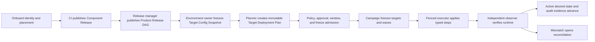

# Enterprise Operator Control Plane Implementation Plan

> **For agentic workers:** REQUIRED SUB-SKILL: Use superpowers:subagent-driven-development (recommended) or superpowers:executing-plans to implement this plan task-by-task. Steps use checkbox (`- [ ]`) syntax for tracking.

**Goal:** Deliver the approved Option A enterprise deployment control plane as sequential, reviewable community PRs, then prove it with neutral targets and adopt it for Choice TP DEV without rewriting Choice TP pilot history.

**Architecture:** Extend the existing `ReleaseBundle`, `DeploymentPlan`, `DeploymentTarget`, `Environment`, task, and external-execution foundations. Add canonical placement identity, immutable target configuration, component/product releases, target-resolved DAGs, governance, campaigns, executor protocol v2, independent observed state, operator read models, and narrow sample cleanup. Keep protocol v1 and all historical IDs, bytes, checksums, events, and pilot evidence intact.

**Tech Stack:** Go, PostgreSQL migrations, chi/oaswrap APIs, Angular 22/TypeScript, Vitest, Playwright for role-based UI E2E, OCI/Sigstore provenance libraries already present in `go.mod`, pnpm, mise, Docker Compose, Jenkins-compatible publish-only CI.

## Global Constraints

- The approved behavior is fixed by `docs/superpowers/specs/2026-07-14-enterprise-operator-control-plane-design.md` at commit `cd1e6cf7`.
- Implement exactly one core PR at a time. Merge or explicitly approve its evidence before starting its dependent PR.
- Rebase and inspect `internal/migrations/sql` before each schema PR. The migration numbers below are reserved from the current latest migration, 137; if upstream lands a migration first, renumber the unopened pair without changing order or meaning.
- Add an `.up.sql` and `.down.sql` pair for every numbered migration. Down migrations may refuse destructive rollback after live v2 data exists, but must document and test that refusal.
- Use additive schema, dual-read comparison, checkpointed backfills, and feature flags. Never rewrite v1 release JSON, canonical bytes, IDs, checksums, callback evidence, or target history.
- `ExternalExecution` remains protocol v1 with ADR-0052 at-most-once semantics. Protocol v2 uses separate records, routes, fencing, and an explicit superseding ADR; no in-flight v1 conversion is allowed.
- Existing `CustomerOrganization`, `Application`, `ApplicationVersion`, `ReleaseBundle`, `DeploymentPlan`, `DeploymentTarget`, `Environment`, and `TargetComponentState` identities are reused or linked. Do not create parallel customer, product, target, or plan sources of truth.
- Community code and UI stay adopter-neutral. Jenkins, ECR, EMLO, Choice TP, money-changing, and transaction-service bindings belong only in adopter repositories and rollout evidence.
- No production or adopter mutation is authorized by this plan alone. Live deployment starts only after PR-083, neutral proof, backup/restore proof, an approved Choice TP campaign, and a final preflight with no blockers.
- Preserve the user-approved cleanup boundary: Choice TP audit/history is protected; only explicitly allowlisted hello-distr, tutorial, and demo ownership boundaries may be retired.
- Do not enable unfinished control-plane flags in shared or production environments. Test flags may be enabled only in isolated fixtures until PR-083 declares the cutover gate satisfied.
- Never store secret values in releases, snapshots, plans, logs, callbacks, evidence, or audit exports. Store provider references and non-reversible version fingerprints only.
- Every API query and mutation validates organization plus customer/environment/target/unit scope in repository and service layers; handlers must not leak whether a foreign ID exists.
- Every immutable record uses canonical JSON and a `sha256:` checksum. Every list/read-model endpoint is server-paginated and deterministically ordered.
- Use `TIMESTAMPTZ` for exact approval, execution, observation, audit, lease, and admission instants. Calendar decisions also retain IANA zone, rule version, local wall time, and UTC offset.
- Each PR updates its ADR if applicable, `docs/fork/PR-###_*.md`, `docs/fork/FORK_DIFF_INDEX.md`, API/operator docs, upgrade notes, and this plan's checkbox state.
- Before claiming a PR complete, run focused tests, live PostgreSQL repository tests, migration validation, full Go tests, Angular tests/build, Hub build, agent builds when protocol code changes, formatting, diff-scoped lint, and secret/Unicode scans.

---

## 1. Source Baseline and Worktree Contract

- Repository: `C:\Users\pc\Documents\Codex\2026-06-22\ple\worktrees\codex-emlo-control-plane-pilot`
- Branch: `codex/emlo-control-plane-pilot`
- Approved spec commit: `cd1e6cf7`
- Current latest migration: `137_external_execution_config_inputs`
- Current latest implemented fork slice: PR-054 / ADR-0054
- Current compatibility contract:
  - Release Contract v1 remains readable and executable.
  - `ExternalExecution` remains one row per `StepRun`, claim-before-dispatch, callback-deadline rejecting, at-most-once v1.
  - Choice TP Loyalty A/B/A pilot history remains immutable proof data.

At the start of every PR:

```powershell
git status --short --branch
git fetch fork
git rebase fork/codex-emlo-control-plane-pilot
Get-ChildItem internal/migrations/sql | Sort-Object Name | Select-Object -Last 6 -ExpandProperty Name
mise run test:go
```

Expected: the worktree is clean, the branch is based on the last accepted PR, the next reserved migration is unused, and baseline Go tests pass. If the worktree is dirty or the migration number is occupied, stop and reconcile before editing.

### 1.1 Branch, review, and publish flow

The verified remotes are `origin=https://github.com/distr-sh/distr.git` for upstream and `fork=https://github.com/namemlo/distr.git` for EMLO-owned publication. The program integration branch is `fork/codex/emlo-control-plane-pilot`; PR-055 starts from the approved spec/plan head. Each implementation branch uses `codex/pr-###-<slug>`, targets the program integration branch, and is deleted only after its commit/evidence is retained.

```powershell
git switch codex/emlo-control-plane-pilot
git pull --ff-only fork codex/emlo-control-plane-pilot
git switch -c codex/pr-055-operator-control-plane-flags
# implement, verify, commit, and review PR-055
git push -u fork codex/pr-055-operator-control-plane-flags
```

For later PRs, replace the number/slug and branch from the just-accepted program head. Do not stack multiple unreviewed schema PRs. PR-083 produces the release evidence required for a separately reviewed merge from the program branch to `fork/main`; Choice TP is never deployed from an unreviewed feature branch.

## 2. Sequential PR, Migration, and ADR Ledger

| PR     | Migration |  ADR | Deliverable                                                                                                           | Primary acceptance                             |
| ------ | --------: | ---: | --------------------------------------------------------------------------------------------------------------------- | ---------------------------------------------- |
| PR-055 |      None | None | Reconcile PR-054 index; register `operator_control_plane_v2` and `executor_protocol_v2`; document production-off rule | prerequisite                                   |
| PR-056 |       138 | 0055 | Canonical deployment registry identity and scoped validation                                                          | Generic mechanics; primary AC-03–AC-07         |
| PR-057 |       139 |    — | Registry preview/apply imports, classification, coverage report, setup UI                                             | Generic import support for AC-01–AC-04         |
| PR-058 |       140 | 0056 | Immutable Target Config Snapshots and verification                                                                    | AC-08, AC-11, AC-12, AC-59                     |
| PR-059 |       141 |    — | Restartable v1 config extraction/lineage with dry-run and rollback flag                                               | AC-14, AC-68 config                            |
| PR-060 |       142 | 0057 | Component Release Contract v2, artifact variants, target-neutral validation                                           | AC-09, AC-10, AC-13                            |
| PR-061 |      None |    — | Provenance verification, v1-derived backfill, CLI/UI compatibility                                                    | AC-65, AC-68; generic support for AC-55        |
| PR-062 |       143 | 0058 | Product Release capability graph and publication                                                                      | AC-15, AC-16, AC-18, AC-78                     |
| PR-063 |       144 | 0059 | Target-plan drafts, requirement resolver, immutable plan publication                                                  | AC-17, AC-19, AC-20, AC-27                     |
| PR-064 |       145 |    — | Exact verified baseline, accumulated change set, risk classification, previous-release plan                           | AC-25, AC-26, AC-56                            |
| PR-065 |       146 |    — | Typed backup/migration/validation/recovery graph                                                                      | AC-21–AC-24, AC-60, AC-61, AC-77               |
| PR-066 |       147 | 0060 | Scoped authorization, role bindings, organization/environment feature enrollment                                      | AC-30, AC-67 scope                             |
| PR-067 |       148 |    — | Versioned deployment policies and strict shared-scope composition                                                     | AC-28, AC-67 policy                            |
| PR-068 |       149 |    — | Approval requests, requirements, decisions, invalidation, four-eyes                                                   | AC-29, AC-75                                   |
| PR-069 |       150 | 0061 | Versioned maintenance calendars and deployment freezes                                                                | AC-31, AC-74                                   |
| PR-070 |       151 |    — | Admission evaluation and checksum-bound emergency override                                                            | AC-32, AC-71 admission                         |
| PR-071 |       152 | 0062 | Campaign drafts, immutable revisions, waves, membership, prerequisites                                                | AC-42, AC-62, AC-80                            |
| PR-072 |       153 |    — | Campaign scheduler, persisted state machine, thresholds, bake policy                                                  | AC-36–AC-38, AC-66                             |
| PR-073 |       154 |    — | Pause/resume/retry/exclude/cancel controls                                                                            | AC-39–AC-41, AC-71 controls                    |
| PR-074 |       155 |    — | Versioned adapter capabilities, assignments, and plan-time resolution                                                 | AC-76                                          |
| PR-075 |       156 | 0063 | Signed and fenced executor protocol v2; explicit v1 boundary                                                          | AC-33–AC-35, AC-58, AC-69                      |
| PR-076 |       157 |    — | Cancel, status query, callback-loss reconciliation                                                                    | AC-40, AC-41, AC-70                            |
| PR-077 |       158 | 0064 | Pending/active desired state, independent observations, drift/reconciliation                                          | AC-43–AC-45, AC-57, AC-72, AC-73               |
| PR-078 |       159 | 0065 | Correlated audit events, evidence bundles, external export checkpoint                                                 | AC-46, AC-47                                   |
| PR-079 |       160 | 0066 | Fleet/release/plan/campaign/execution/reconciliation read models                                                      | AC-50 API                                      |
| PR-080 |      None |    — | Operator control-room routes, role-aware UI, legacy redirects, Playwright E2E                                         | AC-63                                          |
| PR-081 |      None |    — | Two neutral adapters/targets and roadmap-scale performance/failure proof                                              | AC-50, AC-51, AC-53                            |
| PR-082 |       161 | 0067 | Allowlisted sample retirement, audit tombstones, interruption-safe cleanup                                            | AC-48, AC-49, AC-64, AC-79                     |
| PR-083 |      None |    — | Full regression, mixed v1/v2 rollback proof, release/operator docs, adopter evidence assignments                      | Community matrix; AC-54 assigned to ADOPTER-05 |

The detailed tasks are split by subsystem:

- `docs/superpowers/plans/2026-07-14-control-plane-foundations.md` — PR-055 through PR-065.
- `docs/superpowers/plans/2026-07-14-control-plane-governance-execution.md` — PR-066 through PR-078.
- `docs/superpowers/plans/2026-07-14-control-plane-operator-adoption.md` — PR-079 through PR-083 and Choice TP adoption.

### 2.1 Primary acceptance ownership

| Owner         | Acceptance IDs                                                            |
| ------------- | ------------------------------------------------------------------------- |
| PR-056/057    | AC-03, AC-04, AC-05, AC-06, AC-07; generic support for AC-01 and AC-02    |
| PR-058/059    | AC-08, AC-11, AC-12, AC-14, AC-59, config portion of AC-68                |
| PR-060/061    | AC-09, AC-10, AC-13, AC-65, release portion of AC-68; support for AC-55   |
| PR-062        | AC-15, AC-16, AC-18, AC-78                                                |
| PR-063        | AC-17, AC-19, AC-20, AC-27                                                |
| PR-064        | AC-25, AC-26, AC-56                                                       |
| PR-065        | AC-21, AC-22, AC-23, AC-24, AC-60, AC-61, AC-77                           |
| PR-066        | authorization regression for AC-05; scope portions of AC-30, AC-67, AC-75 |
| PR-067        | AC-28 and policy portion of AC-67                                         |
| PR-068        | AC-29, decision portion of AC-30, AC-75                                   |
| PR-069        | AC-31, AC-74                                                              |
| PR-070        | AC-32 and admission portion of AC-71                                      |
| PR-071        | AC-42, AC-62, AC-80                                                       |
| PR-072        | AC-36, AC-37, AC-38, AC-66                                                |
| PR-073        | AC-39, AC-40, AC-41, control portion of AC-71                             |
| PR-074        | AC-76                                                                     |
| PR-075        | AC-33, AC-34, AC-35, AC-58, AC-69                                         |
| PR-076        | cancel/status portions of AC-40, AC-41, AC-70                             |
| PR-077        | AC-43, AC-44, AC-45, AC-57, AC-72, AC-73                                  |
| PR-078        | AC-46, AC-47                                                              |
| PR-079        | API/performance portion of AC-50                                          |
| PR-080        | AC-63                                                                     |
| PR-081        | AC-50, AC-51, AC-53 and neutral cross-boundary regressions                |
| PR-082        | generic proof for AC-48, AC-49, AC-64, AC-79                              |
| ADOPTER-01/02 | primary evidence owner for AC-01, AC-02, AC-52, AC-55                     |
| ADOPTER-03/04 | adopter AC-56, AC-57, AC-58, AC-59, AC-65, AC-69, AC-70, AC-73, AC-76     |
| ADOPTER-05    | AC-52, AC-54 and adopter AC-66, AC-67, AC-80                              |
| ADOPTER-06    | adopter AC-48, AC-49, AC-64, AC-79                                        |

Every cross-cutting ID has one primary owning row even when later PRs/adopter tasks rerun it as regression evidence.

## 3. Feature-Flag and Compatibility Matrix

| Flag/enrollment                          | Added         | Behavior when disabled                                                | Production activation                            |
| ---------------------------------------- | ------------- | --------------------------------------------------------------------- | ------------------------------------------------ |
| `operator_control_plane_v2` process flag | PR-055        | New routes return 404/feature-disabled; v1 reads/execution unchanged  | Flag on only after PR-083                        |
| `executor_protocol_v2` process flag      | PR-055        | No new v2 admission; v2 history remains readable; v1 unchanged        | After PR-075 plus observer proof                 |
| scoped control-plane enrollment          | PR-066        | Organization/environment is not eligible even when process flag is on | Enable Choice TP DEV only after neutral proof    |
| plan `protocolVersion`                   | PR-063/075    | Frozen `v1` plans retain ADR-0052; `v2` plans use fenced attempts     | Selected at publication, never changed in flight |
| dual-read comparison                     | PR-059 onward | Old v1 read remains authoritative until comparison passes             | Remove only in a separately approved future PR   |

The process flag is a kill switch, not the tenant rollout policy. The effective gate is:

```text
process flag enabled
AND organization enrollment active
AND selected environment enrollment active
AND required slice capability complete
AND immutable record explicitly uses schema/protocol v2
```

## 4. Standard Client Deployment Workflow

This is the operator flow to prove in PR-081 and use for Choice TP DEV after PR-083.



### 4.1 Onboard once

1. Import a source inventory with tool version, source commit, parameters, raw report digest, and classification.
2. Map the physical target to one existing `CustomerOrganization`, `DeploymentTarget`, and one explicit active `Environment` assignment.
3. Register one `DeploymentUnit` for the physical runtime boundary; add every subscriber instead of cloning shared units.
4. Map every physical service to a logical `ComponentDefinition` and `ComponentInstance`; resolve renamed services through immutable aliases.
5. Register executor and independent observer assignments plus target capabilities.
6. Bind scoped policy, approval, calendar, freeze, and audit-export ownership.

### 4.2 Publish a component, never deploy from CI

CI supplies source ref, actual commit, build identity, platform OCI digests, SBOM reference, signed provenance, capabilities provided/required, migrations, and release notes. Distr validates and publishes an immutable Component Release. Jenkins or another CI system stops after publication; it does not SSH to the client or mutate Compose.

### 4.3 Assemble the Product Release

The release manager pins Component Release IDs and publishes a capability DAG. Product-stage cycles or missing providers block publication. Requirements declared as target-resolved remain symbolic until target planning and must name the allowed modes.

### 4.4 Freeze target configuration

Create a Target Config Snapshot from the version-controlled environment source. It stores immutable object references/checksums, component mappings, feature flags, and opaque secret references/fingerprints. A later Git/config change does not alter an existing plan.

### 4.5 Build the exact target plan and change log

The planner selects the target/unit/environment and Product Release. Distr selects the exact last independently verified healthy active state, not the numerically previous release. The change view compares:

- component versions and immutable platform digests;
- target configuration object and aggregate checksums;
- capability providers/bindings and adapter versions;
- schema/backup/migration actions and rollback compatibility;
- source notes accumulated across every skipped release;
- target placement, policy/calendar versions, and expected observed-state checksum.

No healthy baseline produces a clearly labeled bootstrap plan. Drift between planning and execution fails compare-and-set and requires a new plan or reconciliation.

### 4.6 Resolve the money-changing/transaction dependency

The generic pattern is a consumer requiring a capability such as `transactions.api` with a compatible version range. Target planning records exactly one resolution:

- `pinned-existing`: a healthy transaction provider is already observed; freeze its release, capability, and observation checksum without redeploying it;
- `included`: the Product Release includes the provider; provider backup/migration/deploy/health nodes precede money-changing nodes;
- `shared-provider`: freeze the upstream plan/step and expected observation checksum; subscriber policies compose to the strictest effective result;
- `approved-external`: freeze the external binding, health proof, policy exception, and checksum; or
- `feature-disabled`: freeze the declared feature flag and approved policy.

An undeclared, ambiguous, unhealthy, or version-incompatible provider blocks plan publication. A later provider/adapter/config change cannot silently rebind an approved plan.

### 4.7 Approve, schedule, and campaign

Publish freezes the plan checksum. Policy creates approval requirements; four-eyes and scoped permissions are enforced. Calendar/freeze admission records the exact UTC/local rule decision. The campaign freezes ordered members, plan checksums, waves, prerequisites, thresholds, and bake policy. Tag changes do not change approved membership.

### 4.8 Execute and observe

The selected protocol is frozen in the plan. V2 dispatch uses a signed intent, stable step keys, attempt identity, lease/fencing generation, idempotent event sequencing, resource locks, cancel/status semantics, and bounded redacted evidence. Executor success is provisional until a separately registered observer verifies digest, config, schema, capability, and health.

### 4.9 Finish, reconcile, or deploy a previous state

Trusted observations advance verified components from pending to active desired state. Failure, cancel, timeout, callback loss, or mismatch preserves prior active state and opens a visible reconciliation case. Deploying a previous successful state creates a new immutable B-to-A plan with the old digest/config and new approval/history; it never rewrites B.

## 5. Per-PR Test-First Cycle

Every implementation task follows this sequence:

- [ ] Add the smallest package/API/repository/UI test named by the subsystem plan.
- [ ] Run the focused test and record the expected failure: missing type/function/table/route or asserted behavior mismatch.
- [ ] Implement only the behavior required by that failing test.
- [ ] Re-run the focused test and record PASS.
- [ ] Add cross-organization, idempotency, canonical-checksum, redaction, and compatibility tests relevant to the behavior.
- [ ] Run live PostgreSQL repository/integration tests with `DISTR_TEST_DATABASE_URL`.
- [ ] Run the complete PR verification matrix.
- [ ] Update ADR, fork PR note/index, API/operator/upgrade docs, and acceptance evidence.
- [ ] Commit with one focused message and request review before the next PR.

Use these baseline commands from the Distr worktree:

```powershell
mise run lint:migrations
go test -p=1 ./...
mise run lint:go
pnpm exec ng test --watch=false
pnpm run build:community
mise run build:hub:community
mise run build:agent:docker
mise run build:agent:kubernetes
git diff --check
```

Expected: all commands exit 0. A documented pre-existing full-repo lint failure may not be used to waive errors in touched files.

For schema PRs, additionally run against a disposable PostgreSQL 18 database:

```powershell
if ([string]::IsNullOrWhiteSpace($env:DISTR_CONTROL_PLANE_TEST_DATABASE_URL)) {
  throw 'DISTR_CONTROL_PLANE_TEST_DATABASE_URL is required; live PostgreSQL tests must not skip'
}
$previousTestDatabaseUrl = $env:DISTR_TEST_DATABASE_URL
try {
  $env:DISTR_TEST_DATABASE_URL = $env:DISTR_CONTROL_PLANE_TEST_DATABASE_URL
  go test ./internal/db -count=1
  if ($LASTEXITCODE -ne 0) { throw 'live PostgreSQL repository tests failed' }
} finally {
  if ([string]::IsNullOrEmpty($previousTestDatabaseUrl)) {
    Remove-Item Env:DISTR_TEST_DATABASE_URL -ErrorAction SilentlyContinue
  } else {
    $env:DISTR_TEST_DATABASE_URL = $previousTestDatabaseUrl
  }
}
```

Expected: repository, migration-up, migration-down/refusal, idempotent-backfill, and isolation tests pass; the disposable database contains no unresolved migration.

## 6. Review and Merge Gate

A PR is accepted only when its evidence bundle contains:

- purpose and generic user story;
- exact schema/API/UI/protocol changes;
- compatibility and rollback/kill-switch behavior;
- security, redaction, and cross-scope analysis;
- focused red-to-green test transcript;
- full verification transcript and build artifacts;
- migration/backfill dry-run counts where applicable;
- API examples and operator walkthrough;
- remaining limitations and the next PR prerequisite;
- confirmation that no adopter-specific term or credential entered core code.

Do not start the next PR if any acceptance item is marked assumed, untested, or deferred without an approved plan change.

## 7. Choice TP DEV Adoption Gate

Choice TP work is a separate adopter change set after PR-083. It uses an isolated clean worktree because the current `emlo-env-settings` checkout has unrelated user changes and is behind its remote branch.

The adopter path is:

1. **ADOPTER-01 — Inventory and manifest:** reproduce the pinned fleet inventory; classify all roots; import the Choice TP DEV physical runtime; map every service and dependency; retain raw checksums.
2. **ADOPTER-02 — Publish-only CI:** update component pipelines to build once, sign, and publish Component Releases. Remove direct deployment from the new path but retain the old path disabled and documented for controlled rollback during pilot.
3. **ADOPTER-03 — Executor and observer:** install scoped external-executor and independent-observer bindings; prove status, cancel, callback-loss, restart, redaction, and fencing in DEV.
4. **ADOPTER-04 — A/B/A proof:** publish A and B, plan exact A-to-B change, deploy B through a one-target campaign, independently verify it, then create and execute a new B-to-A previous-state plan.
5. **ADOPTER-05 — Full placement proof and cutover report:** run publish/plan/DAG/execution/observation for every managed Choice TP DEV placement; explicitly mark remaining placements external or observe-only; prove the transaction-provider dependency; show zero mutable/direct deployment use or a dated owner-approved exception.
6. **ADOPTER-06 — Narrow cleanup:** back up and restore-verify, preview exact hello-distr/tutorial/demo IDs, prove zero reverse references to protected Choice TP history, obtain approval, apply idempotently, and verify Choice TP login/release/plan/task/observation history.

No remote command, ECR push, Jenkins change, Distr mutation, or cleanup apply occurs until the preceding adopter gate has passed and the campaign/preflight identifies the exact target, artifact digests, backup, approvers, window, and rollback/forward-fix path.

## 8. Acceptance Coverage Audit

Before PR-083 is accepted, generate `docs/release/enterprise-control-plane-acceptance.md` with one row per AC-01 through AC-80 and these columns:

```text
Acceptance ID | Owning PR | Automated test | Manual/fixture evidence | Status | Artifact/checksum
```

The gate fails if any ID is absent or duplicated without a primary evidence owner. PR-083 requires retained evidence for every community/neutral row; AC-01, AC-02, AC-48, AC-49, AC-52, AC-54, AC-55, AC-64, and the adopter application of AC-79 remain explicitly `pending-adopter` with ADOPTER task owners until Choice TP execution fills their evidence cells. Core PRs may supply generic mechanics for those rows but are not their primary evidence owner. No other row may be pending. PR-083 also proves:

- v1-only reads/executions with both new flags disabled;
- mixed v1/v2 reads and policy-compliant mixed bundles;
- restartable backfill with unchanged v1 IDs/bytes/checksums;
- v2 kill switch blocking new admission while preserving history;
- two neutral targets before any Choice TP mutation;
- all performance thresholds from spec section 20.9;
- no community-core adopter terminology via a changed-file scan.
