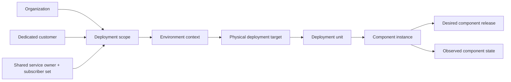
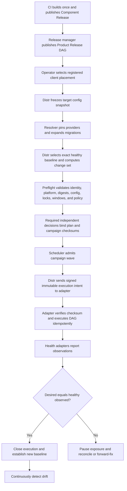

# Enterprise Operator Control Plane — Option A Design

## Document control

| Field | Value |
|---|---|
| Decision | **Option A — immutable releases, target plans, and deterministic campaigns** |
| Process decision approved | 2026-07-14 |
| Written specification status | Proposed for final review; implementation remains gated |
| Repository baseline | `aac92c650bad1a9c1e3f1ba53deb9acc9eace4b2` on `codex/emlo-control-plane-pilot` |
| Core scope | Community-neutral Distr operator control plane |
| Adopter validation | A 28-component DEV target described in Appendix B; current controlled deployment proof is Loyalty A/B/A only |
| Related architecture | `docs/roadmaps/DISTR_COMMUNITY_FORK_MASTER_PLAN.md`, ADR-0051 through ADR-0054 |

This document converts the approved operating model into an implementable design. It does not authorize a production deployment, registry publish, data cleanup, or target mutation. Those actions remain behind implementation, verification, and deployment gates.

## 1. Executive decision

Distr will use four distinct immutable records:

1. A **Component Release** records one build of one logical component, its exact artifacts by platform, source identity, supply-chain evidence, capabilities, and operational contract. It is target-neutral.
2. A **Product Release Manifest** pins a compatible set of component releases and their dependency graph. It is also target-neutral.
3. A **Target Deployment Plan** binds one product release to one resolved deployment scope (a dedicated customer or one shared unit plus its frozen subscriber set), environment, physical target, deployment unit, component-instance set, target configuration snapshot, exact previous-successful baseline, lifecycle policy, and executable step graph.
4. A **Deployment Campaign** freezes an ordered set of target plans into deterministic waves with concurrency, bake, health, pause, and failure rules.

Distr is the system of record for desired state, planning, policy, approvals, execution intent, observations, reconciliation, and audit. A CI system builds; an OCI registry stores artifacts; a configuration repository stores non-secret configuration; and executor adapters such as Jenkins perform target mutations. None of those adopter-specific systems is hard-coded into the community core.

The central rule is:

> Build once, identify by digest, resolve dependencies explicitly, freeze target inputs, approve the checksum, deploy progressively, and compare observed state with the exact desired state.

## 2. Scope and success definition

### 2.1 Goals

The design must support:

- more than 20 clients with more than 20 component placements per client;
- dedicated, shared multi-tenant, and externally managed delivery models;
- AMD64 and ARM64 artifact variants without rebuilding during promotion;
- one reusable component release across different client configurations;
- multi-component releases with explicit capabilities, dependencies, migrations, health checks, and ordering;
- an exact target-specific change log from the last verified successful deployment;
- checksum-bound approvals, maintenance windows, freezes, and separation of duties;
- deterministic cross-client waves with pause, retry, resume, exclusion, and threshold stop;
- safe previous-release deployment when compatible and forward-fix when rollback is unsafe;
- desired-versus-observed drift detection and approved reconciliation;
- complete, externally retainable audit evidence; and
- a community-neutral implementation validated on at least two independent targets before fleet adoption.

### 2.2 Non-goals

Distr will not:

- replace source control, CI, the OCI registry, secret vault, or runtime observability platform;
- rebuild artifacts for each client or environment;
- store secret values inside release manifests, plan payloads, logs, or audit exports;
- infer undeclared service dependencies from naming or Compose order;
- promise atomic rollback across independent services and databases;
- treat an older release as automatically safe after a schema or contract change;
- clone one shared physical deployment into fictional per-subscriber deployments;
- embed adopter names, Jenkins job names, registry accounts, server addresses, or credentials in core code; or
- make runbook scheduling, blue-green deployment, or replacement of Jenkins a P0 dependency for Option A.

## 3. Evidence and current-state assessment

### 3.1 What the current fork already proves

The current branch provides a strong release and execution spine:

- immutable release bundles and canonical checksums;
- release-contract validation;
- deployment plans and preflight checks;
- target/component locks;
- externally executed actions with authenticated callbacks;
- expected plan fields plus executor-callback-projected target-component state and observations;
- deploy-previous-release as a new forward deployment; and
- immutable execution-time configuration inputs.

ADR-0051 through ADR-0054 remain accepted foundations. In particular, external-execution protocol v1 keeps ADR-0052's at-most-once dispatch, callback deadline rejection, and new-plan requirement after lost delivery. Option A proposes a separately versioned protocol v2 with fenced idempotent attempts; adopting it requires a new ADR that explicitly supersedes only those v1 delivery semantics. It must not silently change existing executors or history.

The existing adopter pilot proved a single component through release A, release B, and a B-to-A previous-release deployment, including terminal lock release and retained evidence. That is a valid pilot for the execution spine. It is not proof of the full fleet workflow.

### 3.2 Confirmed gaps

| Area | Current behavior | Option A requirement |
|---|---|---|
| Release contract | Schema v1 combines target configuration with a component contract | Target-neutral Component Release Contract v2; target configuration moves to a plan-bound snapshot |
| Plan identity | Environment and target IDs are validated independently | Every component instance resolves through the full customer/environment/target/deployment-unit identity |
| Config scope | A release-level service config checksum is repeated across selected targets | Each target plan pins its own immutable non-secret configuration snapshot |
| Dependency handling | Affected components exist, but there is no enforced capability DAG | Publication and planning validate capability ranges, cycles, placement, and execution order |
| Approval | Eligibility can report that approval evaluation is unavailable | Policies, decisions, four-eyes rules, freezes, and checksum invalidation are enforced |
| Authorization | Primary permissions are organization-scoped and broad roles receive the same permissions | Least-privilege action permissions scoped through customer, environment, deployment unit, and campaign |
| Previous-state comparison | Proven for the single-component pilot | Persist the exact healthy observed baseline and compute a full component/config/dependency/migration delta |
| Campaigns | No deterministic cross-target wave state machine | Frozen ordered membership, thresholds, bake time, pause/resume, retry, and idempotency |
| Drift | Callback-projected per-component state/observations exist; an independent observer trust boundary does not | Fleet ingestion, pending/active desired revisions, independently trusted observations, drift policy, and reconciliation workflow |
| Operator UI | Entity-first pages expose release/task primitives | Task-oriented Fleet, Releases, Deployments, Approvals, Reconciliation, Audit, and Setup workspaces |
| Runbooks | Definition and publication exist; execution/scheduling is incomplete | Remains P1 and does not block Option A P0 |

### 3.3 Adopter evidence boundary

Appendix B pins the current adopter inventory, pilot evidence, multi-client scale, and 28-service DEV validation target. Those are acceptance inputs for one rollout, not core constants or universal limits. The community requirement is a repeatable registry import that reports additions, removals, renames, and unclassified roots from any adapter.

## 4. Design principles and invariants

| ID | Invariant |
|---|---|
| INV-01 | One component version and platform maps to one immutable artifact digest. A changed digest requires a new release identity. |
| INV-02 | A Component Release and Product Release contain no client selection, target address, mutable configuration path, or secret value. |
| INV-03 | A target configuration change creates a new Target Config Snapshot and Target Deployment Plan; it does not create a new global Product Release. |
| INV-04 | Every executable component instance resolves through one deployment ownership scope, one environment context, one physical target, and one deployment unit. |
| INV-05 | A physical target may serve multiple environment assignments, but each deployment-unit placement has exactly one active environment context in a plan. |
| INV-06 | A shared multi-tenant runtime is represented once, with subscriber bindings and blast radius; it is not duplicated per subscriber. |
| INV-07 | Change comparison starts from the same component instance's last successful execution with a healthy verified observation, never merely the preceding semantic version. |
| INV-08 | Dependency resolution has no implicit success. Every requirement is included, pinned to compatible healthy state, bound to an approved shared/external provider, feature-disabled by approved exception, or unresolved and blocked. |
| INV-09 | An approval is bound to a canonical plan or campaign checksum and policy version. Any material change invalidates it. |
| INV-10 | Protocol v1 preserves ADR-0052 at-most-once semantics. Protocol v2 may use at-least-once attempt delivery only after an explicit superseding ADR; its dispatch, operations, status import, and retries are fenced and idempotent by execution, attempt, and step key. |
| INV-11 | Desired state, executor-reported state, and independently observed state are separate records. Success requires the policy-defined observation gate. |
| INV-12 | The control-plane audit is append-only at the application boundary and exported to retention-controlled append-only storage. |
| INV-13 | Core models and protocols are adapter-neutral. Adopter-specific CI, registry, config, target, and health behavior lives behind typed adapters. |
| INV-14 | All scheduling, maintenance-window, and freeze decisions use an explicit IANA timezone and record the evaluated instant and rule version. |
| INV-15 | Schema-affecting failure defaults to forward-fix unless the contract proves application, dependency, and schema compatibility for previous-release deployment. |

## 5. Canonical identity and topology

### 5.1 Identity hierarchy



The hierarchy is a resolution path, not a claim that every table has a simple parent foreign key. A target can have several explicit `TargetEnvironmentAssignment` records. A plan selects one assignment for each deployment unit. This introduces the roadmap's required target-to-environment mapping while preventing an ambiguous execution context; the current `DeploymentTarget` record itself has no environment binding.

### 5.2 Core records

| Record | Purpose and required identity |
|---|---|
| `CustomerAccount` | The client or consuming organization inside the Distr organization boundary. |
| `DeploymentScope` | Exactly one dedicated customer or one organization-owned shared service with a frozen subscriber-set fingerprint. |
| `DeliveryModel` | `dedicated`, `shared`, or `external`; defines ownership, blast radius, and allowed adapters for a Deployment Scope. |
| `Environment` | Lifecycle context such as DEV, UAT, or PROD, including timezone and policy bindings. |
| `DeploymentTarget` | Physical or logical execution endpoint with platform, adapter, ownership, and capability metadata. |
| `TargetEnvironmentAssignment` | Explicitly allows a target in an environment; carries active dates and policy constraints. |
| `DeploymentUnit` | Smallest independently mutated runtime boundary, such as a Compose project, namespace, host stack, or external endpoint. |
| `SubscriberBinding` | Links customers to one shared deployment unit and records blast radius without cloning the unit. |
| `ComponentDefinition` | Stable logical component identity and capability namespace. |
| `ComponentInstance` | Placement of a logical component in one deployment unit, including physical service name, config namespace, database boundary, and health adapter. |
| `ComponentAlias` | Controlled mapping from legacy physical identifiers to one logical component; aliases are versioned and auditable. |

The unique placement key is:

```text
organization + environment assignment + deployment unit + component instance
```

Customer identity is direct for dedicated units. Shared units are owned by the organization or designated service owner and expose subscriber bindings as blast-radius evidence; no individual subscriber is falsely treated as the physical deployment owner. All reads and writes also enforce the organization boundary.

### 5.3 Registry import and classification

The configuration adapter discovers candidate roots and component placements, but discovery never silently activates a target. Import produces a reviewable diff with these states:

- `managed`: Distr may plan and execute;
- `observe-only`: Distr records state but cannot execute;
- `external`: a declared provider outside the executor boundary;
- `legacy-cutover`: direct deployment temporarily remains under a dated exception;
- `backup`: retained but not deployable;
- `retired`: immutable history only; or
- `unclassified`: blocks fleet-completeness acceptance.

Renames require an alias or explicit retirement/new-instance decision. Deleting a source directory does not delete control-plane history.

### 5.4 Shared-unit policy composition

A shared-unit plan binds the unit owner plus an immutable affected-subscriber set and subscriber-set checksum. Its effective policy is deterministic and conservative:

- deployment is allowed only in the intersection of the owner and affected subscribers' applicable maintenance windows;
- any applicable freeze blocks admission;
- every owner/subscriber approver group retains its own quorum, eligible membership, and separation-of-duty constraint; the effective decision is the conjunction of all group constraints, so one group's approvers cannot satisfy another group's quorum;
- risk, notification, data-residency, and health requirements use the strictest applicable value;
- every affected subscriber appears in the change set and blast-radius review; and
- subscriber membership or policy change creates a new plan and invalidates plan/campaign approval.

If no common window exists, the physical shared deployment cannot be split fictionally by subscriber. Planning blocks until the owners agree a coordinated window or each required authority grants a checksum-bound exception.

## 6. Immutable release and plan layers

### 6.1 Component Release Contract v2

CI publishes a target-neutral contract after a successful releasable build. The contract is canonicalized, checksummed, and immutable after publication.

```json
{
  "schema": "distr.release-contract/v2",
  "component": "example-api",
  "version": "2.4.0",
  "source": {
    "repository": "canonical-source-id",
    "commit": "full-commit-sha",
    "buildRef": "ci-build-identity"
  },
  "artifacts": [
    {
      "platform": "linux/amd64",
      "image": "registry/component:2.4.0",
      "digest": "sha256:...",
      "provenanceRef": "oci-or-uri-reference",
      "sbomRef": "oci-or-uri-reference"
    }
  ],
  "capabilities": {
    "provides": [{ "name": "example.read", "version": "2.1.0" }],
    "requires": [
      {
        "name": "identity.verify",
        "range": ">=1.5.0 <3.0.0",
        "resolutionStage": "target",
        "allowedModes": ["pinned-existing", "included"]
      }
    ]
  },
  "operations": {
    "requiredDeploymentCapability": "deploy.compose/v1",
    "requiredHealthCapability": "observe.http-json/v1",
    "migrations": []
  },
  "changes": {
    "summary": "User-facing and operator-facing release notes",
    "commits": ["full-commit-sha"]
  }
}
```

The contract must not contain a customer name, environment URL, target hostname, Compose file path for a client, secret, or client-specific configuration checksum. Adapter references describe a portable operation contract, not a particular Jenkins job.

Publication rejects:

- a reused component version/platform with a different digest;
- a missing digest or unsupported platform;
- invalid capability versions or ranges;
- a migration without ordering, compatibility, and failure metadata;
- target-specific fields;
- missing or untrusted provenance when policy requires it; and
- a checksum that does not match canonical content.

Release policy also verifies that the canonical source, requested source ref, actual built commit, pinned build dependencies, and CI build identity are allowed for the intended release channel. A branch/environment mismatch or unverifiable built commit blocks publication or target eligibility.

The envelope keeps the current string discriminator: v1 is `distr.release-contract/v1` and v2 is `distr.release-contract/v2`. The parser dispatches only on a recognized exact value and rejects unknown schemas. Schema v1 records remain readable for history. During a feature-flagged migration, a Product Release may pin v1 and v2 records only after safe v1 target fields are extracted into Target Config Snapshots. A restartable backfill preserves original IDs, bytes, and checksums and links any derived v2 record; it never rewrites historical evidence. Disabling the v2 flag restores v1 read/execute behavior for untouched v1 plans, not a lossy reverse conversion.

### 6.2 Product Release Manifest

A Product Release pins a coherent set of Component Release IDs and a validated dependency DAG.

```json
{
  "schema": "distr.product-release/v1",
  "product": "example-product",
  "version": "2026.07.14.1",
  "components": [
    { "component": "identity-api", "componentReleaseId": "uuid" },
    { "component": "example-api", "componentReleaseId": "uuid" }
  ],
  "dependencyPolicyVersion": "uuid",
  "releaseNotes": "Product-level summary"
}
```

The graph is derived from the pinned contracts and any product-level constraints. Each requirement declares `resolutionStage`:

- `product` requires a provider Component Release inside the Product Release; or
- `target` deliberately defers resolution and declares the allowed target modes (`included`, `pinned-existing`, `shared-provider`, `approved-external`, or `feature-disabled`).

The graph, including symbolic target-bound requirement nodes, is frozen with the Product Release checksum. Publication fails on cycles, conflicts, unsatisfied product-stage requirements, target-stage requirements without explicit allowed modes, missing declared product-platform coverage, or inconsistent migration constraints. Target planning must resolve every symbolic node and target-specific platform requirement; none may remain unresolved at plan publication.

A Product Release does not contain target cohorts, wave membership, client variables, secret references, or a target configuration snapshot. Those belong to plans and campaigns.

### 6.3 Target Config Snapshot

A Target Config Snapshot is immutable non-secret evidence for one deployment-unit context. It contains:

- configuration repository identity and immutable commit;
- deployment descriptor object references and checksums;
- service configuration object references and checksums;
- physical service-name to Component Instance mapping;
- secret **references**, provider versions, and non-reversible reference fingerprints, never secret values;
- feature flags that affect dependency resolution;
- adapter input object references and checksums;
- database endpoint identity as an opaque managed reference, not credentials;
- target platform and runtime constraints; and
- creator, creation time, source adapter, and canonical checksum.

The source adapter treats every imported file as untrusted until classified. It rejects embedded secret material or extracts it into an approved secret provider and stores only an opaque reference/version fingerprint. Redaction applies to import diagnostics, plan views, executor payloads, logs, callbacks, evidence artifacts, and audit export. Diagnostic bodies are size-bounded.

Creating a new snapshot never mutates an earlier plan. If the source repository moves, the commit and checksums in the snapshot remain the execution inputs.

### 6.4 Target Deployment Plan

A plan freezes one resolved deployment decision:

```text
Product Release checksum
+ organization/deployment scope/delivery model/subscriber-set fingerprint
+ environment assignment
+ target/deployment unit/component instances
+ Target Config Snapshot checksum
+ exact healthy baseline observation IDs
+ dependency resolution result
+ migration and health step graph
+ lifecycle/policy/window versions
+ non-secret variable fingerprints
= Target Deployment Plan checksum
```

`PlanDraft` is a mutable, non-executable builder with optimistic concurrency and no valid approval. Validation and publish atomically create an immutable `TargetDeploymentPlan` and checksum. Every published plan step has a stable key, prerequisites, target lock key, database lock key when applicable, timeout, retry class, cancellation behavior, expected input checksum, and observation requirement. A correction creates a superseding plan from a new draft that points to the prior plan and records the reason.

### 6.5 Deployment Campaign

`CampaignDraft` is a mutable, non-schedulable builder. Validation and publish create an immutable `CampaignRevision` that freezes:

- ordered wave definitions;
- exact plan IDs and plan checksums per wave;
- membership selection evidence and tag-expression version;
- concurrency by organization, target, deployment unit, database, and adapter;
- health thresholds and evaluation windows;
- bake durations;
- pause, failure, exclusion, and retry rules;
- maintenance-calendar evaluation policy;
- approval policy and emergency policy versions; and
- a canonical campaign checksum.

Changing membership, order, threshold, bake time, concurrency, a member plan, or policy creates a new campaign revision and invalidates prior approval.

Campaign revisions may include cross-plan prerequisite edges for shared providers. Because a future observation ID does not yet exist, the downstream plan freezes an `UpstreamStateExpectation` containing upstream plan ID, step key, provider placement, and expected-state checksum—not a fictional observation ID. At later admission, the scheduler records the actual trusted observation ID as execution evidence and requires its measured-state checksum to match the frozen expectation. A mismatch pauses admission and requires reconciliation or a new plan/campaign revision; the downstream plan is never silently rebound.

## 7. Versioning and build-once policy

### 7.1 Component versions and digests

- The public component version follows that component's versioning policy, normally SemVer.
- A published `(component, version, platform)` tuple can point to only one digest.
- Rebuilding the same source because the base image, compiler, dependency lock, or build parameters changed creates a new component release identity and version; it never replaces an existing digest.
- A multi-platform release has a manifest-list digest plus recorded platform-specific digests. Planning selects an exact compatible platform digest.
- Human-friendly tags are locators only. Execution and observation compare digests.
- Artifact promotion copies or references the same bytes; it does not rebuild them.

The earlier single-component pilot intentionally used distinct versions and digests for repeated builds of the same source to test A/B/A execution. That evidence remains valid, but it is not the final build-once operating rule.

### 7.2 Product and plan versions

- Product Release versions identify a target-neutral compatible component set.
- Target Config Snapshots use immutable IDs and checksums, not a global product version.
- Plans use immutable IDs and monotonic human-readable revisions within their placement context.
- Campaigns use immutable IDs and revisions; a campaign version does not change its component artifacts.

This separation prevents a client configuration edit from creating a fake new software release and prevents a global release from silently changing one client's runtime.

## 8. Change log and exact target comparison

The operator sees three separate change views:

| View | Baseline | Contents |
|---|---|---|
| Component release notes | Prior component source/release | Source commits, work items, image digest, build/provenance, declared capability and operation changes |
| Target deployment change set | Exact last verified healthy state for each Component Instance | Version/digest changes, accumulated source changes, config checksum changes, dependency provider changes, migration/schema transitions, feature flags, topology, and expected downtime/risk |
| Campaign summary | Frozen member plans | Clients/targets affected, wave order, blast radius, approvals, windows, thresholds, exclusions, and aggregate risk |

### 8.1 Baseline selection algorithm

For each Component Instance in a new plan:

1. Find the newest completed execution for the same placement key whose required post-deployment observations are healthy.
2. Verify that the observation identifies the expected release digest and config checksum. Executor success without the required observation is not a successful baseline.
3. Store the execution and observation IDs in the new plan. Later success does not move this baseline.
4. If no verified successful state exists, mark the component as an initial deployment and require the environment's bootstrap policy.
5. Compare desired component release, platform digest, config snapshot, capabilities, provider bindings, migration/schema state, and topology with the frozen baseline.
6. Accumulate skipped source release notes for operator convenience, but never substitute version ordering for the exact observed baseline.
7. Canonicalize and checksum the generated change set as part of the plan.

This answers “what changed since this client was last deployed” even when the client skipped releases, received a hotfix, used a different configuration revision, or previously deployed an older release.

### 8.2 Risk classification

The plan derives a reviewable risk summary from declared facts:

- artifact-only change;
- configuration-only change;
- capability provider or contract change;
- topology or shared-blast-radius change;
- reversible migration;
- forward-only migration;
- destructive or contract-phase migration;
- maintenance-window impact;
- first deployment or missing baseline; and
- exception use.

Risk classification selects policy; it never silently grants approval.

## 9. Capability dependencies and execution DAG

### 9.1 Capability model

Components declare versioned capabilities rather than repository or container-name dependencies. A requirement includes:

- capability name and compatible version range;
- required or optional cardinality;
- allowed provider scope: same unit, same environment, shared unit, or approved external;
- health and observation freshness requirements;
- deployment ordering semantics;
- feature flag that disables the requirement, if supported; and
- resolution stage and allowed target-resolution modes; and
- failure impact and rollback coupling.

The resolver returns one explicit state for every requirement:

| Resolution | Meaning |
|---|---|
| `included` | A compatible provider release is included in this Product Release and plan. |
| `pinned-existing` | A compatible provider is already present in the target context and has a fresh healthy observation; its exact state is pinned in the plan. |
| `shared-provider` | A declared shared deployment unit supplies the capability; blast radius and state are pinned. |
| `approved-external` | A registered external provider satisfies the contract under an approved exception or standard policy. |
| `feature-disabled` | A declared feature flag removes the requirement; the flag and policy are in the config snapshot. |
| `unresolved` | No valid provider exists; product publication blocks product-stage requirements and plan publication blocks every remaining target-stage requirement. |

There is no generic “ignore dependency” result.

### 9.2 Graph expansion

The Product Release graph answers which releases are compatible. The target plan expands it into operational nodes:


Independent branches may run concurrently only when target, deployment-unit, database, adapter, and policy locks permit it. The plan stores the resolved graph; the executor does not recalculate dependencies.

### 9.3 Example: a money-changing service and transaction provider

The adopter proof includes a money-changing service that calls a transaction service. Its generic contract is modeled as a required transaction capability.

Planning behaves as follows:

1. If a compatible transaction provider is already deployed in the selected environment context and its health observation is fresh, pin that exact provider state and deploy only the money-changing release.
2. If the Product Release includes a required compatible transaction release, expand transaction migrations/deployment/health before money-changing deployment.
3. If the environment legitimately uses an external transaction provider, require a registered external-provider binding, contract probe, and policy-approved evidence.
4. If the product feature can be disabled, require the declared disabling flag in the frozen config snapshot and a permitted policy.
5. Otherwise block the plan with the missing capability and remediation options.

This rule generalizes to every component and avoids hard-coding either adopter component name.

## 10. Database migrations, backup, and recovery

### 10.1 Structured migration contract

Each migration entry declares:

- stable migration ID and checksum;
- owning component and database/schema resource key;
- expected source and resulting schema/contract version;
- phase: `expand`, `data`, `switch`, or `contract`;
- ordering and dependency prerequisites;
- lock type, timeout, and estimated operational impact;
- backup requirement and evidence verifier;
- precondition and postcondition probes;
- retry safety and idempotency key;
- reversibility classification;
- previous-application compatibility range;
- recovery procedure reference; and
- whether failure requires forward-fix.

Filenames and commit-message heuristics may assist discovery but are not sufficient execution contracts.

### 10.2 Ownership

| Owner | Responsibility |
|---|---|
| Service owner | Migration artifact, compatibility declaration, validation queries, recovery procedure, and release notes |
| Database/platform owner | Backup mechanism, restore test policy, database credentials in the vault, resource locks, and operational window |
| Distr | Contract validation, graph ordering, evidence gate, policy/approval, desired state, and audit |
| Executor adapter | Execute only frozen migration inputs, stream evidence, honor locks/timeouts, and return structured results |
| Operator/approver | Review risk, backup proof, compatibility, and recovery mode before authorizing |

### 10.3 Recovery rules

- A failed pre-deployment backup blocks mutation.
- A failed expand migration stops dependent nodes; completed idempotent nodes remain recorded.
- A reversible migration may run a declared reverse action only when the policy, current schema state, and dependent component compatibility all permit it.
- A forward-only, data, switch, or destructive contract migration defaults to forward-fix.
- “Deploy previous release” is always a new plan. It is allowed only when the current schema and provider contracts satisfy that previous application's declared compatibility.
- Database restore is a separate emergency operation with explicit data-loss analysis, approval, and evidence; it is never an automatic side effect of application rollback.
- Multi-component recovery follows reverse dependency order where safe. Shared-database and shared-runtime blast radius is surfaced before approval.

### 10.4 P0 typed database actions

Migration safety does not depend on the P1 general runbook engine. Option A provides these P0 typed plan actions:

- `database.backup.create`;
- `database.backup.verify`;
- `database.migration.apply`;
- `database.migration.validate`;
- `database.migration.reverse` when the contract proves it safe; and
- `database.restore.execute` as a typed manual checkpoint allowed only in a separately approved recovery plan; and
- `database.restore.verify` for an isolated recovery drill.

Adapters implement the typed contract and return structured evidence. `database.restore.execute` freezes the backup ID/checksum, destination resource, expected data-loss/time boundary, procedure version, required approver groups, operator scope, validation probes, timeout, and terminal states. The manual operator must claim that exact step, verify authorization/checksum, upload structured evidence, and report completion through the normal callback/observation boundary. It cannot run from an ordinary application deployment or be auto-inserted as rollback. General arbitrary runbook authoring and scheduling remains P1.

## 11. End-to-end standard deployment workflow



### 11.1 Onboard once

1. Import or register the customer, delivery model, environments, timezone, target, deployment unit, and all physical component placements.
2. Classify every discovered root and placement; map legacy names to logical components.
3. Register adapters, target platform, health contracts, database resource keys, secret references, windows, freezes, policies, and ownership.
4. Register component release pipelines in publish-only mode. Direct mutable-path deployment becomes a governed cutover exception.
5. Run observe-only discovery and compare the recorded observed state with the actual runtime before enabling execution.

### 11.2 Release a component

1. The service repository passes tests, security checks, and release policy.
2. CI builds each required platform once, pushes the immutable artifact, generates provenance and SBOM references where policy requires them, and signs/publishes Component Release Contract v2.
3. Distr verifies schema, signature, digest subject, source, trusted builder, build type, parameters, platform, capability contract, and operation metadata.
4. Publication records an immutable release; it does not deploy.

### 11.3 Assemble a product release

1. The release manager selects exact Component Release IDs.
2. Distr resolves the target-neutral capability graph and reports cycles, conflicts, missing providers, migration coupling, and platform gaps.
3. The manager reviews product release notes and publishes the immutable Product Release Manifest.
4. Publication still does not select or deploy a client.

### 11.4 Plan a client deployment

1. The operator selects an already registered deployment-unit placement; arbitrary target IDs cannot be combined in the UI or API.
2. Distr freezes the Target Config Snapshot at an immutable source commit.
3. Distr resolves target-specific providers and expands the operational graph.
4. Distr pins the exact last verified healthy baseline and creates the full target change set.
5. Preflight validates organization isolation, environment assignment, customer binding, target platform, artifact existence, config checksums, provider health, migration state, secret references, locks, window, freeze, and lifecycle eligibility.
6. Distr creates an immutable plan/checksum and renders the operator review.

### 11.5 Approve and schedule

1. The policy engine evaluates every member plan first and then the campaign-level blast-radius policy; each gate may record an automatic decision or require independent approval.
2. Approvers see the exact checksum, target change set, dependency graph, migrations, backup evidence, blast radius, window, risk, and exception use.
3. An approval decision binds the checksum in an authoritative decision record and records actor, role, time, reason, and policy version. This is not a cryptographic signature unless an adopter enables a separately designed signing provider.
4. The scheduler re-evaluates start-time gates. A not-yet-open window, temporary freeze, unavailable concurrency slot, or transient healthy-observation freshness check waits/pauses without changing a checksum. A changed target/config/artifact/provider/baseline, a materially different policy, or an unexpected shared-provider result requires a new published plan and campaign revision with new approval; it never mutates or silently substitutes an approved member.

### 11.6 Execute and verify

1. Distr acquires target/component/database locks and creates an execution attempt.
2. A short-lived scoped execution token and signed intent carry the execution ID, plan checksum, step inputs, expected digests/checksums, and callback contract.
3. The adapter verifies the intent, executes only those inputs, and reports step events idempotently.
4. Health adapters independently observe artifact digest, non-secret config checksum, schema/capability state, and health.
5. Distr marks success only after the required observation gate passes, releases locks, and makes the observation the next exact baseline.
6. The audit export correlates release, product, plan, campaign, wave, execution, adapter, approval, digest, config, observation, and outcome IDs.

### 11.7 Operate after deployment

1. Periodic observations compare actual state with the desired plan.
2. Drift opens a reconciliation case; policy decides whether to alert, auto-plan, require approval, or declare an authorized exception.
3. Reconciliation always produces a traceable action or plan. It never overwrites history.
4. A later deployment begins from the last verified healthy observed state, not from assumptions about what should be running.

## 12. Approval, authorization, windows, and freezes

### 12.1 Roles and separation of duties

| Role | Typical permissions |
|---|---|
| Component publisher | Publish signed component contracts; cannot approve or execute production deployment |
| Product release manager | Assemble and publish Product Releases |
| Deployment planner/requester | Create plans and campaigns within assigned customer/environment scope |
| Approver | Approve or reject eligible checksums; production policy can prohibit self-approval |
| Executor service | Claim and report authorized execution only; cannot alter release, plan, or approval |
| Fleet operator | Pause/resume campaigns, retry safe work, and initiate reconciliation within scope |
| Emergency manager | Authorize predefined acceleration or freeze override; cannot suppress mandatory evidence |
| Auditor | Read/export checksum-bound, application-append-only evidence and externally retained copies; no mutation permission |

Permissions are action-specific and resource-scoped. Organization scope remains mandatory, with optional narrowing by customer, environment, deployment unit, component, and campaign. Developer and administrator are not implicitly equivalent.

### 12.2 Default lifecycle policy

| Environment class | Default gate |
|---|---|
| DEV | Automatic after valid preflight unless migration, shared blast radius, or local policy requires approval |
| UAT | Named requester and at least one authorized approver; window policy as configured |
| PROD | Independent requester/approver, checksum-bound evidence, maintenance-window/freeze evaluation, risk-based minimum approvers, and executor identity separation |

Adopters may make a policy stricter. Relaxation requires a versioned policy or emergency rule and audit evidence.

### 12.3 Invalidation

Approval becomes invalid when any of these changes:

- release or artifact digest;
- target, environment assignment, deployment unit, or component membership;
- config snapshot or non-secret variable fingerprint;
- dependency/provider resolution;
- migration, backup, or health graph;
- baseline observation;
- maintenance-calendar/freeze rule or version, timezone/rule binding, override, or policy version;
- campaign membership, order, concurrency, threshold, or bake time; or
- an exception used by the plan.

### 12.4 Windows, freezes, and emergencies

- Positive maintenance windows and negative freezes are evaluated in their configured IANA timezone.
- The plan records the rule version; the scheduler records the actual evaluation at start.
- An ordinary evaluation outcome such as “closed now, opens later” is admission evidence outside the approved checksum and causes waiting, not approval invalidation. Changing the rule/version/timezone or applying an override is material and requires the decision behavior defined above.
- A freeze prevents new execution admission. It does not promise to suspend arbitrary work already mutating a target.
- Emergency acceleration defines in advance who may invoke it and which approval/wait/test gates may shorten or defer. Authorization, artifact/config integrity, required evidence, health admission, and any migration-required backup remain pre-mutation. A deliberately deferred gate runs as soon as possible under the recorded emergency policy.
- Every override requires a reason and is visible in the change set, timeline, and audit export.

### 12.5 Plan and campaign approval composition

- Every published plan must have a current eligible plan decision, whether automatic or human. A campaign approval never substitutes for a missing or invalid plan decision.
- A campaign policy may additionally require approval of aggregate blast radius, membership, order, concurrency, bake, thresholds, and shared-provider edges. Both plan and campaign decisions are required when that gate applies.
- A single-plan execution needs only its plan decision unless policy deliberately wraps it in a campaign.
- Emergency authority can satisfy only the specifically declared emergency decision requirement. It does not transform an invalid plan or bypass mandatory integrity, observation, migration-backup, or authorization gates.
- Decision writes use optimistic concurrency and a stable request/actor idempotency key. Duplicate identical decisions return the existing result; conflicting or concurrent decisions resolve once against the current revision and retain rejected/superseded attempts in audit.

## 13. Campaign waves and failure semantics

### 13.1 State machine

```text
Draft -> Validated -> AwaitingApproval -> Scheduled -> Running
Running -> Paused | Failed | Completed | Cancelling
Paused -> Running | Cancelling
Cancelling -> Cancelled | Failed
```

Every transition is conditional, authorized, idempotent, and audited.

### 13.2 Deterministic waves

An example fleet strategy is:

1. internal or dedicated DEV proof target;
2. named pilot clients;
3. low-risk production cohort;
4. remaining cohorts by risk and timezone.

The exact plan IDs and order are frozen. Dynamic tag evaluation occurs when drafting a campaign and its result is stored; membership does not drift while the campaign runs.

Membership selection and ordering are canonical: identical inventory snapshot, tag rules, policy version, plan set, and ordering inputs produce the same ordered membership and campaign checksum across process restarts.

Production policy expresses bake time in risk- and usage-appropriate hours or days and normally increases it as exposure broadens. Lower environments may use shorter feedback intervals. Any production deviation requires a checksum-bound approved exception.

Before each next wave, Distr evaluates:

- required completion and healthy-observation percentage;
- maximum failure and unknown-state thresholds;
- critical alert status;
- policy-defined risk-based minimum bake duration, normally increasing with broader exposure unless an approved exception explains the deviation;
- upcoming client windows and freezes; and
- manual intervention when policy requires it.

### 13.3 Pause, retry, resume, exclude, and cancel

- **Pause** stops launching new target executions. By default, already in-flight executions continue to their next safe terminal/intervention point.
- **Cancel** sends a typed cancel request only to adapter steps that declare cancellation support. Distr continues reconciling uncertain target state after a request.
- **Retry** under protocol v1 follows ADR-0052 and creates a new superseding plan after lost delivery. Under protocol v2, it may create a new fenced attempt for incomplete retry-safe steps under the same immutable plan; completed step keys are not duplicated.
- **Resume** continues from persisted per-plan/per-step state after all gates are re-evaluated.
- **Exclude** requires an authorized reason and removes no history; the excluded plan remains visible in campaign outcome and fleet drift.
- **Threshold stop** atomically prevents new admissions when policy thresholds are breached; it does not misreport in-flight tasks as canceled.

An adapter timeout or lost callback produces `unknown`, not success or immediate failure. A callback received after its deadline is rejected. Reconciliation uses fresh authentication to query adapter/runtime status and may import a proven result as a new reconciliation event; it does not revive or accept the expired callback. Human intervention is required if state cannot be proven.

## 14. Executor trust boundary and protocol

### 14.1 Responsibility split

Distr owns the immutable decision and state machine. The executor adapter owns only the target mutation described by the signed intent.

| Distr | Executor adapter |
|---|---|
| Validate release, plan, policy, approval, locks, and schedule | Verify token, signature, execution ID, plan checksum, and input checksums |
| Resolve dependency and step graph | Execute the supplied typed step without re-resolving releases or config |
| Persist authoritative desired state and event sequence | Stream structured progress and evidence with idempotency keys |
| Decide admission, pause, retry, and reconciliation | Support declared status/cancel operations and safe retries |
| Evaluate independently observed state | Return executor results; never declare control-plane policy success |

### 14.2 Signed execution intent

The intent contains:

- organization, execution, attempt, plan, and step IDs;
- canonical plan checksum and step-input checksum;
- target/deployment-unit adapter identity;
- exact artifact digest and immutable object references;
- expected current/baseline state needed for compare-and-set safety;
- lock fencing token;
- callback endpoint, event sequence contract, and token expiry;
- cancellation and timeout semantics; and
- no plaintext secrets.

The adapter resolves secret references at execution time through its authorized secret provider. A secret-value rotation can trigger a new plan when policy treats it as deployment-affecting; audit records the reference/version fingerprint, not the value.

### 14.3 Delivery and callback behavior

- Protocol version is negotiated and frozen in the plan. A v1 executor can claim only v1 work and retains ADR-0052 behavior.
- Protocol v2 is feature-flagged until its superseding ADR, migration, and compatibility tests pass. It never converts an in-flight v1 execution.
- One-time or short-lived credentials are scoped to one execution attempt.
- Claim, heartbeat, event, completion, and reconciliation callbacks are authenticated.
- The tuple `(execution ID, attempt, step key, event sequence)` is idempotent.
- Duplicate identical events are accepted; conflicting duplicates are security/audit failures.
- Lock fencing rejects a stale executor after lease loss.
- A crash before acknowledged delivery can create a new fenced v2 attempt; a crash after acknowledged delivery first queries status and retries only an operation declared idempotent. V1 instead requires the ADR-0052 new-plan path when delivery cannot be proven.
- Expired callbacks remain rejected. A freshly authenticated status response is stored as reconciliation evidence with its own event identity.
- Completion is not enough to establish success until the required observed-state gate passes.
- The first adopter adapter may be Jenkins, but protocol and persistence use generic executor vocabulary.

### 14.4 Adapter capability resolution

Adapter authority is single-directional:

1. A Component Release declares required deployment, migration, backup, and health **capabilities**, never a concrete job or implementation.
2. A target, deployment unit, Component Instance, database resource, or Observer Registration advertises installed adapter implementations, versions, and supported capabilities.
3. A Target Config Snapshot supplies immutable, non-secret inputs for eligible implementations.
4. Plan resolution selects one compatible implementation/version per typed step and freezes its ID, version, capability, and input checksum.

No later layer can weaken a release capability requirement. Adapter removal, version drift, or capability change after approval blocks start and requires restoration or a new plan/campaign revision.

## 15. Desired state, observations, drift, and reconciliation

### 15.1 State records

| Record | Source | Meaning |
|---|---|---|
| `PlannedIntent` | Published plan | Immutable proposed state; it is reviewable but is neither pending nor active desired state |
| `PendingDesiredRevision` | Admitted execution | Intended state currently being attempted, with execution/plan linkage and terminal outcome |
| `ActiveDesiredRevision` | Independently verified successful component step | Exact release, platform digest, config checksum, provider bindings, schema expectation, and topology that remains authoritative for drift comparison |
| `ExecutorReport` | Executor adapter | What the mutation workflow says it attempted and returned |
| `ObservedComponentState` | Runtime/health adapter | Independently measured artifact/config/schema/capability/health state with timestamp and evidence |
| `DriftCase` | Comparison engine | A classified mismatch, staleness, missing observation, or unauthorized topology change |
| `ReconciliationAction` | Policy/operator | Approved way to restore desired state, accept a new desired state, or document a temporary exception |

Admission creates a pending revision without changing the active revision. A component's active revision advances only after the required trusted observation matches that component's pending revision. On partial success, verified components advance independently; failed, cancelled, or unknown components retain their previous active revision and their terminal pending revision. An unexpected observed mutation therefore appears as drift/reconciliation work rather than silently becoming desired state.

Observations and state revisions are append-only. Current-state read models point to active/pending revisions and the newest trusted observation but do not erase earlier evidence.

### 15.2 Independent observer registration and sequencing

An `ObserverRegistration` binds a health/runtime adapter implementation and version to organization, target/deployment-unit scope, supported measurements, trust root/credential, maximum freshness, and enabled status. A trusted observation carries observer ID, target/component identity, monotonically increasing source sequence when supported, captured-at UTC instant, received-at UTC instant, evidence checksum/reference, measured values, and signature/authentication evidence.

- Unregistered, disabled, wrongly scoped, unauthenticated, or replay-conflicting observations are rejected and audited.
- An exact replay is idempotent. Out-of-order evidence is retained but cannot replace a newer trusted current observation.
- Conflicting trusted observers produce `unknown/conflict` and reconciliation; executor reports never win automatically.
- Freshness is measured from captured time with clock-skew policy, not merely receipt time.
- Observation timeout prevents success. The mutation lock is released only after executor terminal handling or fencing; the placement is quarantined from new mutation while an unknown observation case is unresolved, preventing both deadlock and unsafe concurrency.

### 15.3 Drift classes

- artifact digest differs;
- configuration checksum differs;
- component missing or unexpected;
- capability provider differs or is unhealthy;
- schema version differs;
- target platform or topology differs;
- observation is stale or unavailable;
- desired state has no verified deployment; or
- runtime matches an execution whose callback is incomplete.

Policy may alert, auto-create a plan, require approval, quarantine the placement, or record a time-bounded exception. Directly rewriting desired state to match drift is prohibited.

## 16. Operator control-room experience

The primary navigation is task-oriented:

1. **Fleet** — inventory, placement coverage, desired/observed versions, health, drift, windows, and ownership.
2. **Releases** — Component Releases, Product Releases, artifact/provenance status, notes, and dependency graphs.
3. **Deployments** — plan wizard, exact target change set, campaign designer, execution timeline, retry/previous-release actions.
4. **Approvals** — checksum review, risk, migrations, backup evidence, exceptions, decisions, and expiring gates.
5. **Reconciliation** — unknown executions, drift cases, stale observations, and authorized recovery actions.
6. **Audit** — correlated actor/resource/event timeline and evidence export.
7. **Setup** — customers, environments, targets, units, component aliases, adapters, policies, calendars, and import classification.

### 16.1 Fleet matrix

The default fleet view has one row per deployment unit and expandable Component Instances. It supports server-side pagination and filters for customer, environment, delivery model, component, desired release, observed release, drift, health, window, owner, and management state.

A shared unit appears once with subscriber count and blast radius. The UI does not duplicate it as healthy for every subscriber.

### 16.2 Plan review

Before approval or execution, the operator sees:

- immutable Product Release and target plan checksums;
- target identity breadcrumb from organization to Component Instance;
- exact last verified baseline and observation age;
- component/source/config changes since that baseline;
- dependency graph and resolution status;
- migration, backup, recovery, and downtime facts;
- artifact platform/digest/provenance status;
- maintenance window/freeze evaluation;
- shared blast radius;
- policy, required approvers, and exceptions; and
- a machine-readable plan export.

The UI never auto-combines targets merely because they share a deployment type. Selection is through validated registry placements.

### 16.3 Execution and timeline

The execution page renders the step DAG, locks, attempts, adapter events, health observations, pauses, retries, approvals, and audit correlation. Filtering and pagination are server-side; the UI must not fetch a fixed first page and pretend it is complete.

### 16.4 Workspace interaction contracts

All routes are organization-scoped, deep-linkable, and preserve filter state in the URL. Lists have loading, empty, permission-denied, partial-data, error, and stale/unknown states; details have immutable IDs/checksums and links to related audit evidence.

| Workspace and entry route | List/detail/drawer content | Authorized actions and required states |
|---|---|---|
| Fleet `/fleet` | Server-paged deployment units, expandable Component Instances, shared subscribers/blast radius, desired/pending/observed state, drift, coverage | Import-preview link, open plan, open drift, quarantine; show unclassified, observe-only, unknown, stale, shared-policy-conflict, and unauthorized states |
| Releases `/releases` | Component/Product tabs; contract, artifact/evidence, notes, DAG, comparison and publication timeline | Draft/validate/publish/block where permitted; show v1/v2, mixed migration, invalid contract, cycle, missing provider, untrusted provenance, and archived states |
| Deployments `/deployments/plans`, `/deployments/campaigns`, `/deployments/executions` | Plan drafts/published plans, campaign drafts/revisions, waves, execution DAG/timeline and change drawer | Draft/freeze, request decisions, schedule, pause/resume/retry/exclude/cancel, previous release; show invalidated, waiting-window, frozen, paused, partial, unknown, superseded, and completed states |
| Approvals `/approvals` | Pending/decided/invalidated/superseded queues with target change set, migration/backup, exceptions, plan/campaign checksum and policy | Approve/reject/comment where scoped; show self-approval denial, duplicate/concurrent decision, expired/invalid checksum, missing member decision, and emergency path |
| Reconciliation `/reconciliation` | Drift/unknown/conflict cases, observations, executor status evidence, pending/active desired revisions and case timeline | Assign, query status, create plan, accept time-bounded exception, close with evidence; show stale/replayed/untrusted/conflicting observer states |
| Audit `/audit` | Server-paged correlated events with actor/resource/action/result, checksum lineage, export checkpoint and tombstone resolution | Filter, deep-link, export evidence where permitted; show retention/export lag, redacted fields, unavailable external copy, and permission denial |
| Setup `/setup` | Customers, shared scopes/subscribers, environments, targets, units, components/aliases, adapters/observers, policies/calendars and import jobs | Preview/apply/classify, register/disable, version policies, resolve aliases; show conflict, orphan, unclassified, adapter drift, and destructive-change warnings |

Drawers never hide a blocking fact required for approval; the same information is available through the detail route and machine-readable API. Every mutation has confirmation proportional to impact and returns the resulting immutable or draft revision link.

The existing `/deployments` and `/deployments/:deploymentTargetId` target links remain compatible. The route migration first introduces a `/deployments` shell with static children `/targets`, `/plans`, `/campaigns`, and `/executions`; `/deployments` defaults to the target list, and the legacy target-detail path redirects to `/deployments/targets/:deploymentTargetId` while preserving query/fragment state. Static child matching precedes the legacy ID redirect so names such as `plans` cannot be interpreted as target IDs.

## 17. Conceptual API and persistence additions

Exact route names and migration numbering are implementation-plan details, but the public capability surface must provide:

| Capability | Required operations |
|---|---|
| Registry | Import preview/apply, classify roots, manage assignments/units/instances/aliases, coverage report |
| Component releases | Validate, publish, inspect, compare, block, and retrieve supply-chain evidence |
| Product releases | Draft, validate DAG, publish, inspect graph, and compare |
| Config snapshots | Create from adapter, verify objects/checksums, inspect non-secret metadata |
| Deployment plans | Draft, validate/preflight, inspect change set, supersede, request approval, and deploy previous successful state |
| Policies/approvals | Manage versioned policy, request, decide, invalidate, and list pending work |
| Campaigns | Draft membership, validate, approve, schedule, pause, resume, retry, exclude, cancel, and inspect waves |
| Execution protocol | Claim/dispatch, heartbeat, ordered events, complete, cancel, status query, and reconcile |
| Observations | Ingest, verify trust/freshness, query history/current state, and compare desired state |
| Reconciliation | Open/classify/assign/resolve cases and generate approved plans/actions |
| Audit/export | Correlated search, evidence bundle, and append-only external stream checkpoint |

### 17.1 Persistence families

New or extended tables are grouped as:

- registry: target-environment assignments, deployment units, subscriber bindings, component definitions/instances/aliases;
- release: component releases/artifact variants/evidence, product releases/components/capability edges;
- configuration: target config snapshots and immutable object references;
- plan: plan baselines, resolved requirements, steps/edges, change entries, risk entries;
- governance: policies/versions, approval requests/decisions, calendars/freezes/overrides;
- campaign: revisions, waves, frozen memberships, runs, exclusions, threshold evaluations;
- execution: attempts, fencing locks, step state/events, cancel/reconcile requests;
- state: desired state, observations, drift cases, reconciliation actions; and
- audit: correlated events and external-export checkpoints.

Repository conventions apply except where an exact operational instant is required. Execution, approval, observation, window/freeze evaluation, lease, and audit instants use UTC-aware storage (`TIMESTAMPTZ` or an equivalently unambiguous UTC representation). The IANA zone, local rule/version, evaluated local time, and UTC offset are stored separately for calendar decisions. Existing timezone-less history is migrated with an explicit documented source-zone assumption and never reinterpreted silently. Other conventions remain: organization foreign keys, canonical JSON checksums, forward-compatible enums, indexes for fleet filters, and migrations with explicit rollback/compatibility notes.

### 17.2 Backward compatibility and feature flags

- Existing v1 release contracts and pilot history remain readable.
- Existing deployment endpoints remain available during a governed cutover; new controlled execution is feature-flagged by organization/environment.
- Migration/backfill is additive before old fields become read-only.
- Dual-read comparison verifies new read models against current data before the UI switches.
- Direct mutable-path execution receives an expiry owner/date and is visible as policy debt.
- No data migration rewrites historical checksums or callback evidence.

### 17.3 Existing-identity compatibility map

The design names describe roles, not permission to create parallel sources of truth:

| Design role | Existing Distr identity | Evolution and continuity |
|---|---|---|
| Customer Account | `CustomerOrganization` | Reuse the existing ID/table/routes; add delivery/subscriber relations without copying customers |
| Product definition | `Application` | Reuse the Application ID as the release/process owner; existing routes continue |
| Legacy deployable package | `ApplicationVersion` | Preserve IDs and bytes; it remains a valid legacy bundle component while controlled v2 artifacts gain digest/evidence links |
| Component Definition | No first-class equivalent | Add one organization-scoped logical identity; link legacy `ReleaseBundleComponent.key/name` and physical aliases through restartable mapping, without rewriting old rows |
| Component Release | `ReleaseBundle` plus `ReleaseBundleComponent`/child-bundle support | Extend `ReleaseBundle` with a kind/discriminator and v2 contract; reuse its UUID, status, checksum, audit, and routes rather than create an unrelated release store |
| Product Release | `ReleaseBundle` | Extend the same entity with product kind, pinned child Component Release bundle IDs, and DAG records; current bundle IDs remain valid |
| Target Deployment Plan | `DeploymentPlan` | Add identity/config/baseline/step-graph relations to the existing plan ID and routes; historical plan payload/checksum stays unchanged |
| Target/environment/unit | `DeploymentTarget` and `Environment` | Reuse IDs; add assignment and Deployment Unit/Component Instance records, then backfill explicit placements |
| Executor-projected state | `TargetComponentState` and existing observations | Preserve as legacy/executor projections; link new pending/active desired revisions and independently registered observations without relabeling old evidence |

Backfills use checkpointed batches, dry-run counts, stable old-to-new lineage, and resumable idempotency. Route evolution is additive or versioned. Feature-flag rollback switches readers/executors to preserved v1 paths for untouched v1 records; it never deletes v2 rows or changes historical IDs/checksums.

## 18. Security and supply-chain controls

- Verify the provenance envelope signature against configured roots of trust, match the statement subject to the artifact digest, require an allowed predicate type, and validate trusted builder, canonical source, build type, and external parameters before planning and again before mutation.
- Retain SBOM and provenance references separately; neither is a substitute for the other.
- Use least-privilege scoped tokens, short expiry, rotation, and lock fencing between Distr and executors.
- Keep secrets in approved secret providers. Distr stores references and non-reversible version fingerprints only.
- Prevent cross-organization/customer/environment/target ID substitution at repository, service, and handler layers.
- Treat release publishing, plan creation, approval, emergency override, campaign control, desired-state change, and audit export as privileged audited actions.
- Sanitize and size-bound config-import diagnostics, executor logs, callbacks, and evidence before persistence/export.
- Export audit evidence to retention-controlled append-only storage and monitor export lag/failure.
- Define retention separately for audit, task logs, artifacts, observations, and operational records; do not imply indefinite or WORM retention in the primary database.

This design uses SLSA provenance concepts, NIST SSDF recommendations, and Microsoft Safe Deployment Practices as guidance. Architecture text alone does not establish SLSA level, NIST certification, or product compliance.

## 19. Data cleanup boundary

The community capability can retire or remove explicitly allowlisted non-production sample ownership boundaries after a replacement workflow is verified. Adopter-specific protected and removable names are defined only in Appendix B or an external rollout plan.

The procedure is:

1. Export a database backup and an evidence inventory, verify backup integrity, and prove restore in an isolated validation context before mutation.
2. Produce a dry-run allowlist of exact organization, customer, release, target, plan, task, and related record IDs whose ownership markers prove they belong to the removable boundary.
3. Prove by reverse-reference queries that none of those IDs is linked to a protected release, plan, execution, approval, checksum, observation, lock, or previous-known-good state.
4. Review the allowlist before mutation.
5. Execute one controlled transaction or a restartable idempotent typed cleanup job with per-record audit and interruption recovery proof.
6. Refuse broad name patterns, unbounded cascades, blanket image pruning, or deletion by age alone.
7. Record exact before/after counts and re-run integrity, protected-boundary evidence, login, release, plan, task, and observed-state checks.
8. Retain the backup, dry-run report, applied allowlist, and verification output under the configured evidence policy.

Cleanup never deletes application audit events. Removed domain records leave a tombstone with original subject ID/type and checksum so audit lineage remains resolvable; externally exported evidence is retained under policy. Failed executions, previous-release evidence, and checksums remain history until a separate retention policy—not this cleanup operation—authorizes disposal.

## 20. Acceptance and verification matrix

P0 is complete only when all applicable tests below pass with retained evidence. Unit tests alone are insufficient for cross-boundary behavior.

### 20.1 Registry and identity

| ID | Test | Expected result |
|---|---|---|
| AC-01 | Reproduce and import the pinned adopter inventory | Tool version/parameters, source commit, raw report, and checksum are retained; all 26 standard roots and 649 placements are represented; all 19 non-standard roots have an explicit classification |
| AC-02 | Import the 28-component DEV proof target | All physical Compose services map to logical Component Instances with no silent omission |
| AC-03 | Re-run an unchanged import | No duplicate targets/instances and an empty deterministic diff |
| AC-04 | Rename a physical service without an alias | Import blocks activation and requests alias, retirement, or new-instance classification |
| AC-05 | Substitute an ID from another organization/customer/environment | API, service, repository, preflight, and callback paths reject it without information leakage |
| AC-06 | Plan a target assigned to multiple environments | The selected deployment unit resolves exactly one active environment context; ambiguous selection blocks |
| AC-07 | Register a shared multi-tenant unit | One physical unit is shown with all subscribers and correct blast radius; it is not cloned per subscriber |

### 20.2 Releases, artifacts, and configuration

| ID | Test | Expected result |
|---|---|---|
| AC-08 | Publish one source/platform build and deploy it to two differently configured targets | Both plans use the identical digest and distinct Target Config Snapshots; no rebuild occurs |
| AC-09 | Publish the same component version/platform with a different digest | Publication is rejected and audited |
| AC-10 | Plan AMD64 and ARM64 targets | Each receives the recorded platform digest; missing or mismatched variants block before mutation |
| AC-11 | Put a client URL, target path, or secret value in a v2 Component Release | Contract validation rejects it |
| AC-12 | Modify source config after snapshot creation | Existing plan still resolves immutable objects/checksums; a new deployment requires a new snapshot/plan |
| AC-13 | Tamper with artifact, config object, provenance, or signed intent | Verification blocks before target mutation and records the failed evidence |
| AC-14 | Read pilot v1 release/history after v2 activation | Historical checksums and views remain intact; new controlled publication uses v2 |

### 20.3 Dependencies and migrations

| ID | Test | Expected result |
|---|---|---|
| AC-15 | Publish a cyclic capability graph | Product Release publication is blocked with the cycle path |
| AC-16 | Require a capability with no valid provider | Planning blocks with all attempted resolution modes |
| AC-17 | A compatible healthy provider already exists | Plan pins its exact observed release/capability state and does not redeploy it |
| AC-18 | The required provider release is included | Provider migration/deploy/health nodes precede the consumer nodes |
| AC-19 | Use an approved external provider or feature-disabled mode | Binding/flag, health proof, exception/policy, and checksum are frozen and visible |
| AC-20 | Attempt external/disabled resolution without declared policy | Planning blocks |
| AC-21 | Fail required backup evidence | No migration or application mutation starts |
| AC-22 | Run retry-safe migration after callback loss | The stable migration/step key prevents duplicate effects |
| AC-23 | Request previous release after forward-only schema change | Compatibility gate blocks rollback and requires a forward-fix plan |
| AC-24 | Recover a compatible multi-service partial failure | Safe actions follow reverse dependency order and retain every completed/failed node |

### 20.4 Plans, change logs, approvals, and policy

| ID | Test | Expected result |
|---|---|---|
| AC-25 | Create a plan after skipped releases | Change view is anchored to the exact last healthy observed state and accumulates source notes without assuming sequential deployments |
| AC-26 | First deployment with no baseline | Plan is labeled bootstrap and follows bootstrap approval/preflight policy |
| AC-27 | Runtime drifts after planning but before execution | Expected-baseline compare-and-set or stale preflight blocks mutation and requires a new plan/reconciliation |
| AC-28 | Change config, provider, migration, target, baseline, policy, or window after approval | Original immutable record remains; new checksum/revision requires new approval |
| AC-29 | Requester attempts self-approval under four-eyes policy | Decision is rejected and audited |
| AC-30 | Approval actor lacks target/environment scope | Decision is rejected without broadening role permissions |
| AC-31 | Start outside the maintenance window or during a freeze | Scheduler denies admission; approved override path records actor/reason/rule |
| AC-32 | Use emergency acceleration | Only predefined wait/gates shorten; mandatory integrity, evidence, and health gates still run |

### 20.5 Execution and campaigns

| ID | Test | Expected result |
|---|---|---|
| AC-33 | Deliver duplicate dispatch or callback events | Same idempotency keys return the same result; conflicting duplicates fail securely |
| AC-34 | Lose executor lease and dispatch a stale worker | Fencing token prevents stale mutation/callback acceptance |
| AC-35 | Concurrent plans touch the same component, target, or database | Defined locks serialize or reject them without deadlock |
| AC-36 | Pause a running campaign | No new plan is admitted; in-flight behavior follows recorded safe-point semantics |
| AC-37 | Resume after pause/restart | Persisted state resumes idempotently without repeating completed steps |
| AC-38 | Breach wave health/failure threshold | New exposure stops atomically and the campaign records the exact evaluation |
| AC-39 | Exclude a failed target | Authorized reason is retained; excluded target remains visible as incomplete/drifted |
| AC-40 | Cancel an execution | Only cancellable steps receive requests; uncertain target state enters reconciliation |
| AC-41 | Lose completion callback | Status/reconciliation proves outcome or leaves `unknown`; Distr never invents success |
| AC-42 | Modify a tag after campaign approval | Frozen membership is unchanged; a different membership requires a new campaign revision |

### 20.6 Observed state, audit, and cleanup

| ID | Test | Expected result |
|---|---|---|
| AC-43 | Manually change image or config on a target | Independent observation creates the correct drift class and opens reconciliation |
| AC-44 | Reconcile drift back to desired state | Approved action/plan restores state and links case, plan, execution, and observation |
| AC-45 | Accept a temporary deviation | Time-bounded authorized exception is explicit; desired history is not silently overwritten |
| AC-46 | Trace one deployment end to end | Audit correlates component/product release, config, plan, approval, campaign/wave, execution, adapter, observation, digest, actor, and outcome |
| AC-47 | External audit export fails | Export checkpoint/alert shows lag; primary events remain retryable and ordered |
| AC-48 | Dry-run demo cleanup | Exact allowlist excludes all proof-target history and reports reverse references |
| AC-49 | Apply approved demo cleanup | Only allowlisted demo/tutorial records disappear; integrity and proof-target evidence checks pass |

### 20.7 Scale and neutral end-to-end proof

| ID | Test | Expected result |
|---|---|---|
| AC-50 | Fleet queries at 649 placements and roadmap-scale fixtures | Registry, matrix, comparison, history, and campaign APIs meet the test-environment SLOs in section 20.9 with server pagination/indexes |
| AC-51 | Roadmap performance fixture | Exercise 1,000 targets, 100 concurrent online agents, a 100-component release, a 500-step aggregate wave, large logs, and many scoped variables |
| AC-52 | Full DEV proof bundle | Every managed placement among the 28 completes publish-only CI, plan/DAG, executor, and independent observation with a suitable typed adapter; every remaining placement has an explicit external or observe-only classification; the transaction-provider dependency is explicit |
| AC-53 | Two independent neutral targets | The same community contracts complete end-to-end on two separately configured targets: one external-executor adapter and one deterministic reference adapter; neither path adds adopter-specific core code |
| AC-54 | Cutover report | Every active managed placement has publish-only CI plus Distr-controlled execution; mutable/direct deployment usage is zero or has a dated approved exception |

### 20.8 Operational regressions and adopter proof

| ID | Test | Expected result |
|---|---|---|
| AC-55 | Validate adopter source and provenance policy | Requested source ref, actual built commit, pinned shared-library commit where applicable, CI build, changelog, and digest are recorded; branch/dependency/environment mismatch blocks eligibility |
| AC-56 | Deploy a compatible previous release | A B-to-A action creates a new immutable target plan, restores the exact prior image and target config, passes independent observation, and appends history without rewriting B |
| AC-57 | Executor reports success but independent observation is wrong | Deployment is not successful; digest/config/health mismatch enters failed or unknown reconciliation according to policy |
| AC-58 | Reach every terminal task path | Success, failure, cancellation, timeout, callback loss, and process restart all release leases/resource locks atomically or transfer them only through a valid fencing token |
| AC-59 | Import config containing secrets or oversized errors | Secret content is rejected or converted to opaque provider references; plan/executor/log/callback/artifact/audit surfaces stay redacted and diagnostics are bounded |
| AC-60 | Complete a structured migration | Backup identity/checksum, resource lock, pre/post probes, resulting schema observation, and recovery evidence are retained with the successful plan |
| AC-61 | Perform a restore-verification drill | Isolated restore proof validates the documented recovery artifact/procedure without making restore an automatic deployment rollback |
| AC-62 | Recreate and restart a campaign from identical frozen inputs | Ordered plan membership and campaign checksum are identical; pause/restart/resume preserves order and completed-step state |
| AC-63 | Run role-based operator UI E2E | Authorized roles complete setup/import, release assembly, shared-unit target comparison, approval/invalidated approval, campaign pause/resume, execution/previous release, drift/reconciliation, and audit export/deep links; legacy target URLs redirect correctly; unauthorized, empty, error, partial, stale, and unknown states render correctly; lists use server-side pagination |
| AC-64 | Interrupt and retry cleanup | Verified backup/restore proof exists, allowlist application is idempotent, exact before/after counts reconcile, and Choice TP login/release/plan/task/observation checks pass |
| AC-65 | Verify trusted and deliberately invalid provenance | Trusted envelope, allowed predicate type, artifact subject digest, builder, source, build type, and external parameters pass; self-signed/untrusted, wrong-subject, or wrong-predicate evidence blocks |
| AC-66 | Validate broader campaign bake policy | Each wave meets its risk-based minimum; production uses hours/days appropriate to usage and risk, and broader exposure has a non-decreasing duration unless a checksum-bound approved exception records the reason |
| AC-67 | Plan one shared unit with two subscribers whose windows/policies conflict | Effective policy uses the strictest union/intersection, no common window blocks, every owner/subscriber group independently satisfies its own quorum and separation rules, and subscriber-set changes invalidate approval |
| AC-68 | Exercise mixed v1/v2 migration and rollback flag | Exact schema dispatch works; restartable backfill preserves v1 IDs/bytes/checksums and lineage; mixed bundles obey policy; disabling v2 leaves untouched v1 reads/executions functional |
| AC-69 | Crash a v2 dispatcher before acknowledged delivery | A new fenced attempt is safe and the stale attempt cannot mutate or report; a v1 execution retains ADR-0052 new-plan behavior |
| AC-70 | Crash after acknowledged delivery and deliver an expired callback | Status is queried before retry, only declared-idempotent work can retry, expired callback is rejected, and fresh reconciliation evidence is accepted under a new event identity |
| AC-71 | Edit drafts and change start-time inputs | Draft edits do not create approval/execution authority; publish freezes checksum; an ordinary closed-window/freeze/concurrency outcome waits without invalidating approval, while rule/version/override or material target/config/provider/baseline changes require new plan/campaign revisions and approval |
| AC-72 | Exercise pending/active desired transitions | Success advances active state only after trusted observation; partial failure advances verified components only; failure/cancel/unknown retain prior active state and terminal pending evidence |
| AC-73 | Send stale, replayed, out-of-order, untrusted, and conflicting observations | Trust/scope/freshness/sequence rules reject or retain evidence correctly, conflict enters reconciliation, timeout quarantines safely, and locks/fences do not deadlock |
| AC-74 | Evaluate a DST gap, repeated hour, and timezone-rule update | UTC instant, IANA zone, rule version, local time, and offset yield one reproducible admission decision without double execution |
| AC-75 | Race approval decisions and schedule a campaign with an unapproved member | Idempotent duplicate is stable; conflicting concurrent decision resolves once with audit; superseded decision cannot authorize; campaign admission blocks until every required plan and campaign decision is current |
| AC-76 | Change adapter implementation/version after approval | Release capability remains authoritative; target implementation and config inputs resolve at planning; missing capability or adapter drift blocks start and requires restoration or a new revision |
| AC-77 | Execute P0 backup/migration/validation/reverse/manual-recovery contracts | Typed actions return structured evidence and obey locks/checksums; `database.restore.execute` runs only from its separately approved recovery plan with frozen backup/data-loss/procedure inputs and normal terminal callback/observation semantics |
| AC-78 | Publish a Product Release with target-deferred requirements | Valid symbolic target nodes publish only with declared modes; product-stage gaps block; every target-stage node must resolve before plan publication |
| AC-79 | Remove an allowlisted sample domain record | Application audit event and checksum lineage remain resolvable through a tombstone and external retention; cleanup does not act as retention purge |
| AC-80 | Gate a later wave on an earlier shared-provider change | Downstream plan freezes upstream plan/step and expected-state checksum, admission records the actual matching observation ID, and mismatch pauses without changing or rebinding the plan |

### 20.9 Test-environment performance SLOs

These are repeatable acceptance thresholds for the documented reference fixture, not universal throughput promises for every installation. Evidence records hardware, database size, network, build, dataset seed, concurrency, warm/cold state, and raw percentile output.

| Scenario | Acceptance threshold |
|---|---|
| Fleet/list/detail API at 1,000 targets and 649+ placements | Warm p95 at or below 2 seconds and p99 at or below 5 seconds for page size 100; no unbounded response |
| Create/validate a 100-component target plan excluding external probe latency | p95 at or below 10 seconds and deterministic checksum across five identical runs |
| Materialize/schedule a 500-step aggregate wave | At or below 30 seconds with stable order and no duplicate admission |
| 100 concurrent online agents/executors | Sustain 100 authenticated events per second for 10 minutes with p95 ingest acknowledgement at or below 1 second and zero lost accepted events |
| Large log/evidence path | Stream a 100 MiB step log without loading it wholly into API/UI memory; first page available within 2 seconds after indexing |
| Isolation/error budget | Zero cross-organization records in every result; below 1% non-policy server errors during the fixture run |

## 21. P0 and P1 boundary

### 21.1 P0 for Option A

- hard identity and placement registry;
- target-neutral component contracts and immutable Product Release DAG;
- target-specific immutable configuration and plans;
- exact baseline and change comparison;
- capability dependency resolution, including shared/external/disabled modes;
- structured migrations, backups, compatibility, and forward-fix behavior;
- scoped RBAC, checksum approvals, windows, freezes, and emergency rules;
- deterministic campaigns and failure semantics;
- trusted executor protocol, locks, callbacks, cancel/status, and reconciliation;
- fleet/plan/approval/execution/drift/audit operator views;
- neutral integration and performance proof; and
- adopter inventory parity, 28-component DEV proof, controlled cutover, and narrow cleanup.

### 21.2 P1 unless separately promoted

- general runbook execution and scheduling;
- retention cleanup worker and full retention-policy UI;
- full bidirectional Config-as-Code synchronization;
- integration of existing Distr Agent Docker/Compose execution and application-log collection into the controlled v2 plan/callback/observation protocol;
- dependency graph visualization beyond the P0 review/read model;
- advanced SBOM/vulnerability policy integration beyond retaining/verifying required evidence;
- canary and blue-green target strategies beyond deterministic client waves; and
- replacement of the first external executor adapter.

## 22. Sequential implementation slices

Implementation follows `docs/roadmaps/DISTR_COMMUNITY_FORK_MASTER_PLAN.md`: one reviewable PR at a time. PR numbers are assigned only after the written specification and implementation plan are approved. The fork index must first be reconciled because implemented PR-054 exists while the index currently ends at PR-053.

| Slice | Scope | Exit gate |
|---|---|---|
| A — Registry identity | Environment assignments, deployment units, component instances/aliases, shared subscribers, import preview/classification, scoped validation | AC-01 through AC-07, registry part of AC-67 |
| B — Target configuration | Immutable per-placement config snapshots, secret-reference fingerprints, object verification, compatibility extraction from v1 | AC-08, AC-11, AC-12, AC-14, AC-59, config part of AC-68 |
| C — Component Release v2 | Platform artifacts, target-neutral contract, provenance/SBOM references, immutable version/digest rules | AC-09, AC-10, AC-13, AC-55, AC-65, release part of AC-68 |
| D — Product DAG and migrations | Capability graph, resolver, target expansion, migration/backup/schema contract, exact target change set | AC-15 through AC-27, AC-56, AC-60, AC-61, AC-77, AC-78 |
| E — Governance | Scoped permissions, policies, approvals, separation of duties, windows, freezes, emergency overrides | AC-28 through AC-32, policy part of AC-67, AC-74, AC-75 |
| F — Campaigns | Draft/freeze, membership, waves, cross-plan prerequisites, thresholds, bake, pause/resume/retry/exclude state machine | AC-36 through AC-42, AC-62, AC-66, AC-71, AC-80 |
| G — Executor trust | Versioned intent protocol, fencing, cancel/status/reconcile, desired/observed state, adapter resolution and drift cases | AC-33 through AC-35, AC-41, AC-43 through AC-47, AC-57, AC-58, AC-69, AC-70, AC-72, AC-73, AC-76 |
| H — Operator control room | Fleet, release, deployment, approval, reconciliation, audit, setup flows with server-side read models | AC-63 plus usability evidence across P0 flows |
| I — Neutral verification | Two independent targets/adapters, roadmap-scale fixtures, failure/upgrade/backward-compatibility proof | AC-50, AC-51, AC-53 |
| J — Adopter validation | Import/classification, all component contracts, full DEV proof bundle, controlled pipeline cutover, cleanup dry-run/apply, deployment evidence | AC-48, AC-49, AC-52, AC-54, AC-64, AC-79 |

Every slice includes schema/API/UI/protocol/security/compatibility analysis, an ADR where it establishes a long-lived decision, fork documentation/index updates, targeted tests, broader regression verification, and operator documentation. Feature flags keep incomplete slices unavailable in production.

## 23. Operational ownership and readiness

| Capability | Accountable owner | Required readiness evidence |
|---|---|---|
| Source and release contract | Component team | Tests, version, source commit, capabilities, migrations, notes |
| Build and provenance | CI/platform team | Digest, platform variants, signature/provenance, SBOM reference, reproducible identity |
| Artifact retention | Registry/platform team | Immutable digest availability and retention policy |
| Target configuration | Environment owner | Immutable commit/objects, config checksum, secret references, placement mapping |
| Product release | Release manager | Compatible pinned set, DAG, risk/release notes |
| Target plan | Deployment planner | Exact target, baseline, config, dependency/migration graph, change set |
| Approval/window | Service/client operations | Authorized decision, checksum, schedule/freeze evidence |
| Execution adapter | Platform operations | Scoped credentials, idempotency, logs, callback/status/cancel contract |
| Runtime health | Service/SRE owner | Independent health, digest/config/schema/capability observation |
| Reconciliation | Fleet operator | Drift triage, approved action, closure evidence |
| Audit and retention | Security/compliance owner | Export health, access policy, retention and retrieval proof |

Readiness for an adopter deployment requires named owners for every row. Missing ownership blocks the plan rather than defaulting responsibility to Distr.

## 24. Failure modes and mitigations

| Risk | Design mitigation |
|---|---|
| Registry import mistakes affect many clients | Preview/apply split, classification gate, aliases, observe-only onboarding, immutable history |
| A mutable tag or config path changes after approval | Digest execution, immutable object references/checksums, start-time verification |
| Release graph is compatible globally but not on one target | Target-specific provider resolution, platform/config/schema preflight, pinned existing state |
| One shared service change affects many customers | Single shared unit model, subscriber blast radius, stricter policy and locks |
| Executor reports success but runtime is wrong | Separate independent observation gate and drift/reconciliation state |
| Lost callbacks cause duplicate work | Stable idempotency keys, fencing, status query, uncertain state, safe retry classification |
| Database rollback damages data | Structured compatibility, backup evidence, explicit restore operation, forward-fix default |
| Approval is reused after material change | Canonical checksums, immutable revisions, automatic invalidation |
| Campaign membership changes mid-run | Freeze evaluated membership and member plan checksums |
| Audit database retention is mistaken for permanent evidence | External append-only export, independent retention policy, monitored checkpoints |
| Adopter integration leaks into community core | Typed adapter interfaces, neutral names/contracts, adopter proof isolated to Appendix B and deployment tooling |

## 25. Decisions intentionally left to the implementation plan

The design fixes externally visible behavior. The implementation plan may select the following internal details without changing that behavior:

- exact REST paths and Angular component decomposition;
- normalized versus JSONB storage for immutable contract substructures, subject to query/index requirements;
- queue implementation and executor transport, subject to ordering/idempotency/security requirements;
- concrete policy expression format;
- adapter discovery mechanism;
- production environment SLOs beyond the reference-fixture minimums in section 20.9, plus wave sizes, bake durations, and thresholds consistent with the stated policy constraints; and
- the adopter's exact maintenance schedule and role assignments.

Each deployment must supply concrete values for these policy parameters before campaign validation; production has no unspecified runtime values or implicit defaults.

## Appendix A. Enterprise product and standards crosswalk

Evidence was reviewed on 2026-07-14. The cited sources inform this design; they do not by themselves mandate every Distr requirement.

| Topic | Design alignment | Qualification |
|---|---|---|
| Immutable release promotion | Octopus release/process snapshots and [release guidance](https://octopus.com/docs/best-practices/deployments/releases-and-deployments); [SLSA artifact verification](https://slsa.dev/spec/v1.2/verifying-artifacts) | Distr strengthens this with mandatory digest binding; an Octopus release is not itself the artifact bytes or a cryptographic immutability guarantee |
| Client and environment model | [Octopus tenants](https://octopus.com/docs/tenants/), [tenanted deployments](https://octopus.com/docs/tenants/tenant-creation/tenanted-deployments/), and [spaces](https://octopus.com/docs/administration/spaces) | A tenant is not equivalent to a hard administrative Space or necessarily to application data tenancy |
| Release versus deployment | [Octopus releases](https://octopus.com/docs/releases), [deployment changes](https://octopus.com/docs/releases/deployment-changes), and [release-note accumulation](https://octopus.com/docs/releases/release-notes/) | Distr's exact last-healthy target baseline is an extension; version order alone is not enough |
| Channels/lifecycles/rings | [Octopus channels](https://octopus.com/docs/releases/channels), [lifecycles](https://octopus.com/docs/releases/lifecycles), and [tenant lifecycles](https://octopus.com/docs/tenants/tenant-lifecycles/) | Eligibility filters do not provide deterministic ordered cross-client waves |
| Configuration/secrets | [Octopus variable scopes](https://octopus.com/docs/projects/variables/getting-started), [tenant variables](https://octopus.com/docs/tenants/tenant-variables), and [sensitive variables](https://octopus.com/docs/projects/variables/sensitive-variables/) | Distr adds target config snapshots because live tenant variables are not necessarily snapshotted; deployment tools are not full secret vaults |
| Multi-service coordination | [Coordinating Octopus projects](https://octopus.com/docs/projects/coordinating-multiple-projects/) and [Deploy a Release step](https://octopus.com/docs/projects/coordinating-multiple-projects/deploy-release-step/) | Distr owns the declarative capability DAG, target resolution, and cancel/reconcile semantics; independent projects are not a transaction |
| Approval/RBAC | [Octopus users and teams](https://octopus.com/docs/security/users-and-teams/), [manual intervention](https://octopus.com/docs/projects/built-in-step-templates/manual-intervention-and-approvals/), [ServiceNow approvals](https://octopus.com/docs/approvals/servicenow), and [Octopus Approvals status](https://octopus.com/docs/approvals/octopus-approvals/) | A manual step alone does not prove four-eyes control; built-in Octopus Approvals remains Alpha at the evidence date |
| Windows/freezes | [Octopus deployment freezes](https://octopus.com/docs/deployments/deployment-freezes/) | Octopus blocks new/starting deployments but documents an exception for deployment-target-triggered automatic deployments; Distr's stricter admission behavior is its own policy and does not guarantee suspension/resumption of arbitrary in-flight work |
| Progressive delivery | [Microsoft Safe Deployment Practices](https://learn.microsoft.com/en-us/azure/well-architected/operational-excellence/safe-deployments) and [Octopus tenant deployment FAQ](https://octopus.com/docs/tenants/tenant-deployment-faq/) | Microsoft describes risk-appropriate bake times in hours/days and increasing exposure phases; the design uses production risk-based minimums and ordinarily increasing bake duration, without inventing a universal percentage/duration; tenant batches do not guarantee order |
| Rollback/migrations | [Octopus rollback guidance](https://octopus.com/docs/deployments/patterns/rollbacks) and Microsoft safe-deployment guidance | Older application code is not assumed compatible with a newer schema; forward-fix is the default for unsafe state changes |
| Provenance/SBOM | [SLSA provenance](https://slsa.dev/spec/v1.2/provenance), [SLSA verification](https://slsa.dev/spec/v1.2/verifying-artifacts), and [NIST SP 800-218](https://csrc.nist.gov/pubs/sp/800/218/final) | SBOM and provenance are different evidence types; no SLSA level or NIST certification is claimed |
| Drift/reconciliation | [Octopus deployment-target triggers](https://octopus.com/docs/projects/project-triggers/deployment-target-triggers), [Kubernetes verification](https://octopus.com/docs/kubernetes/deployment-verification), and [Argo live status](https://octopus.com/docs/argo-cd/live-object-status) | Continuous generic-server reconciliation is a Distr extension; Argo drift semantics apply only to that integration |
| Audit/retention | [Octopus auditing](https://octopus.com/docs/security/users-and-teams/auditing), [audit streaming](https://octopus.com/docs/security/users-and-teams/auditing/audit-stream), and [retention policies](https://octopus.com/docs/administration/retention-policies) | Primary product audit/task data is not assumed WORM or retained forever; external retention-controlled export is required |
| Emergency flow | [Microsoft Safe Deployment Practices](https://learn.microsoft.com/en-us/azure/well-architected/operational-excellence/safe-deployments), [Octopus channels](https://octopus.com/docs/releases/channels), and [deployment freezes](https://octopus.com/docs/deployments/deployment-freezes/) | Distr may predefine approval/wait/test acceleration, but integrity, evidence, health, authorization, and any migration-required backup gate remain pre-mutation; a gate deliberately deferred under emergency policy runs as soon as possible and remains visible in audit |

## Appendix B. Adopter validation profile

This appendix defines a real multi-service validation target for the community-neutral model. Current controlled deployment proof covers Loyalty A/B/A only; full 28-component proof is an acceptance gate, not an accomplished claim. The names below are validation data, not core constants.

### B.1 Current discovery evidence

Evidence snapshot identifiers:

| Evidence | Pinned identity |
|---|---|
| Environment inventory source | `emlo-env-settings` target ref `origin/master` at `0ca94a0f55df9403272eadda0839d1ee10f43542` |
| Distr pilot baseline | `aac92c650bad1a9c1e3f1ba53deb9acc9eace4b2` |
| Loyalty pilot evidence document | `emlo-choice-tp-loyalty-pilot-runbook.md`, SHA-256 `fd4e9e7c048176963a0671d1454fbfdec841df534edeaefff0ea41f7a3dae194` |

Before adopter execution, the inventory scan and pilot document are imported into the evidence store with tool version, command/parameters, raw report, checksum, actor, and timestamp. Counts without those artifacts are discovery context, not final acceptance evidence.

The `choice-tp_dev/1/docker-compose.yaml` proof target contains these 28 services:

```text
remittance-webapp
starlingpeak-remittance-webapp
compliance-api
permission-api
audit-api
security-token-service
mc-api
remittance-api
admin-app
background-app
otel-collector-agent
api-gateway
transaction-api
catalog-api
customer-api
conversion-api
kyc-client-api
ids-client-api
remittance-client-api
identity-api
notification-api
marketing-handler-api
loyalty-api
report-api
retail-digital-api
payment-api
ekyc-api
payment-gateway
```

The registry must map all 28 physical names to logical components and classify infrastructure/gateway/web components without pretending every component uses the same deployment or health adapter.

The broader discovery snapshot contains these standard root placement counts:

| Root | Placements | Root | Placements |
|---|---:|---|---:|
| `asiamoneytransfer_prod` | 25 | `choice-tp_dev` | 28 |
| `dev` | 14 | `emlo-afg_prod` | 20 |
| `emlo-afg-admin_prod` | 16 | `eu-prod` | 30 |
| `intag_dev` | 24 | `intag_prod` | 15 |
| `linkremit_prod` | 25 | `lionsgate_admin_dev` | 26 |
| `lionsgate_dev` | 25 | `offshorett_admin_dev` | 27 |
| `offshorett_admin_prod` | 26 | `offshorett_dev` | 25 |
| `offshorett_prod` | 26 | `paymit_dev` | 26 |
| `paymit_prod` | 26 | `prod` | 30 |
| `rozeremit_prod` | 25 | `sangerwal_prod` | 25 |
| `staging` | 31 | `starlingpeak_prod` | 28 |
| `starlingpeak_prod_bank` | 28 | `tango_prod` | 25 |
| `trostify_prod` | 26 | `viacash_dev` | 27 |

### B.2 Adopter adapter bindings

For this proof only:

- Jenkins is the initial build/execution integration, behind generic CI and executor contracts.
- An OCI registry is the artifact store; all execution uses exact digests.
- The environment-settings repository is the candidate target-config source; its files are untrusted until classified and scanned, and the resulting plan snapshot contains only approved non-secret objects plus opaque secret references.
- Existing signed callback and lock behavior from the loyalty pilot is preserved.
- Direct Compose commands, mutable image tags, and blanket image pruning are not part of controlled success.

The adopter source policy records the requested backend/source ref, actual built commit, pinned shared-library commit where applicable, CI build identity, generated changelog, and exact artifact digest. A source-branch, dependency-ref, or environment-policy mismatch blocks release eligibility.

Credentials, host addresses, registry account details, and internal job names do not belong in this document or community core.

### B.3 Money-changing dependency proof

Current configuration shows the money-changing service calling the transaction service. Across the 26 standard roots, 24 co-locate both services; `dev` and `intag_prod` are the two exceptions and require explicit classification rather than an assumption.

Acceptance requires one of these plan-visible outcomes for every money-changing placement:

1. pin a compatible healthy transaction provider already present;
2. include and order a compatible transaction release before money-changing;
3. bind an approved external provider and prove its contract/health; or
4. freeze an allowed feature-disabled configuration.

Missing or incompatible transaction capability blocks deployment.

### B.4 Pilot history and cleanup

The existing Choice TP loyalty A/B/A evidence remains checksum-stable and queryable through migration. Cleanup removes only allowlisted `hello-distr`, tutorial, and demo domain ownership boundaries from active views. It does not remove Choice TP releases, failed attempts, plans, tasks, callbacks, approvals, checksums, locks, observations, or previous-known-good artifacts. Application audit events for removed sample records remain resolvable through tombstones and the external retention stream.

### B.5 Adopter completion gate

The adopter workflow is complete only when:

- all 28 proof-target placements have target-neutral Component Release Contracts or an explicit external/observe-only classification;
- source ref, built commit, pinned shared dependency, CI build, provenance, changelog, and digest satisfy the adopter release policy;
- the full Product Release validates its capability and migration DAG;
- target-specific configuration is frozen outside Component Releases;
- the same component release can be reused by another target without rebuilding;
- the money-changing/transaction dependency scenarios pass;
- publish-only pipelines and controlled execution cover all active managed placements;
- the full plan, approval, execution, observation, drift, and audit workflow passes;
- compatible previous-release, observation-mismatch, lock-release, structured migration, restore-drill, and forward-fix cases are proven safely;
- deterministic campaign restart and the role-scoped operator UI E2E pass;
- cleanup backup/restore, dry-run, interruption retry, and apply preserve the pilot history; and
- deployment evidence is handed over with exact versions, digests, config checksums, plans, approvals, executions, and observed state.

## Appendix C. Written-spec review checklist

Reviewers should approve this specification only if all answers are “yes”:

- Is the four-layer Option A model clear and free of target config in global releases?
- Does the identity model cover dedicated, shared, external, and multi-environment target cases?
- Can an operator tell exactly what changed for one client since its last verified success?
- Are component dependencies and database migrations explicit enough to block unsafe plans?
- Are approvals, windows, freezes, emergency actions, and campaign mutations checksum-bound?
- Are pause, cancel, retry, resume, unknown state, previous release, and forward-fix semantics unambiguous?
- Does desired/observed separation prevent false success and silent drift acceptance?
- Does the UI expose the complete operator workflow for a fleet, not merely entity CRUD?
- Is the core community-neutral while the adopter proof remains concrete?
- Does cleanup preserve Choice TP history and delete only explicit demo/tutorial ownership boundaries?
- Do the acceptance tests cover the 28-component proof target, 649 current placements, and neutral roadmap-scale scenarios?
- Is the sequential one-PR-at-a-time delivery boundary acceptable?

After written approval, the next artifact is a detailed implementation plan that maps each sequential slice to exact schema migrations, handlers/APIs, UI routes/components, tests, ADRs, feature flags, upgrade steps, and verification commands. No implementation or deployment begins before that approval.
